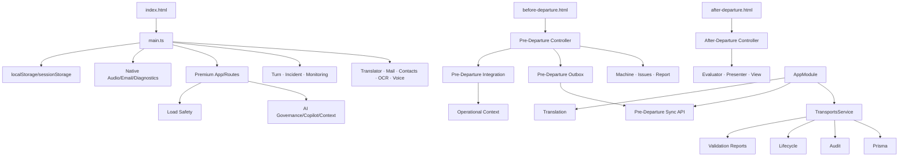

# AGM — MC-2 Analiza modularizării arhitecturale

Data: 2026-07-28  
Regim: analiză structurală; fără modificarea comportamentului  
Baseline: MC-0 închis; MC-1 declarat închis operațional  
Protected scope: materialul de concurs este exclus integral

## 1. Verdict executiv

Complexitatea este concentrată în patru zone:

1. `apps/web/src/main.ts`;
2. `apps/web/src/styles.css`;
3. integrarea neuniformă Pre-Departure / Operational Context /
   After-Departure;
4. `apps/api/src/transports/transports.service.ts`.

Nu au fost demonstrate cicluri directe de import în inspecția efectuată, dar
graful complet nu a fost validat de un instrument dedicat. Absența ciclurilor nu
este declarată ca fapt până la automatizarea verificării.

Verdict:

**MC-2 PASS — STRUCTURAL MAP COMPLETE — MODULARIZATION READY FOR STAGED AUTHORIZATION**

## 2. Măsurători

| Zonă | Fișiere | Linii aproximative | Semnal |
| --- | ---: | ---: | --- |
| `main.ts` | 1 | 4.135 | hotspot critic |
| `styles.css` | 1 | 3.823 | hotspot critic |
| app i18n dictionary | 1 | 2.548 | registru supradimensionat |
| Pre-Departure | 12 | 1.924 | modul mare, dar separat |
| Premium Load Safety | 19 | 989 | fragmentare controlată |
| After-Departure POC | 9 | 949 | boundary bun, integrare lipsă |
| Operational Context | 10 | 599 | nucleu comun |
| AI Governance | 13 | 429 | modular |
| API transports | 6 | 709 | service hotspot |
| API pre-departure sync | 4 | 207 | boundary clar |
| API translation | 6 | 228 | boundary clar |
| Mailmaster | 5 | 151 | boundary clar |
| Contact Manager | 6 | 195 | boundary clar |

`main.ts` are:

- 30 importuri directe;
- 65 de câmpuri într-un singur obiect `state`;
- randare, binding, persistence și side effects în același fișier.

## 3. Registrul modulelor candidate

| ID | Componentă | Clasificare | Problemă | Recomandare |
| --- | --- | --- | --- | --- |
| MOD-01 | `main.ts` | Critical hotspot | 65 state fields, 30 imports, multiple domains | strangler modularization |
| MOD-02 | `styles.css` | Critical hotspot | global scope și ownership multiplu | separare pe domenii după visual baseline |
| MOD-03 | app i18n dictionary | Large registry | trei limbi și toate domeniile într-un fișier | split pe namespace cu API `t()` păstrat |
| MOD-04 | Pre-Departure controller | Medium hotspot | UI, storage, sync și context integration | controller facade + ports |
| MOD-05 | Pre-Departure persistence/outbox | Specialized active | două mecanisme outbox | mapare și adaptor către continuitate comună |
| MOD-06 | Operational Context | Canonical core | types/ports sunt doar web-local | contract platform-neutral |
| MOD-07 | After-Departure POC | Active unaligned | state local, fără TripContext/events | migration adapter către Journey |
| MOD-08 | Premium application registry | Coupling point | importă module prin side effects | registry/factory explicit |
| MOD-09 | Load Safety | Active specialized | API/controllers multiple, contract local | capability contract |
| MOD-10 | AI Governance | Active shared | nu folosește încă DecisionEnvelope comun | contract adapter |
| MOD-11 | Transport service API | Backend hotspot | lifecycle, checks, audit, finance, numbering | use-case decomposition |
| MOD-12 | `@agm/shared` | Orphan candidate | o constantă, zero consumatori identificați | definește rol sau retragere separată |
| MOD-13 | native audio/email/diagnostics | Platform adapters | acces direct din app shell | port/facade comun |
| MOD-14 | incident journal | Active cross-cutting | domain + seed/history + persistence | repository + catalog separation |

Niciun candidat nu este aprobat pentru eliminare.

## 4. Inventarul hotspot-urilor

### 4.1 State coupling în `main.ts`

Grupuri amestecate în același state:

- routing/view;
- profile;
- contacts;
- email compose;
- translator;
- service health;
- OCR;
- text corrector;
- voice input/output;
- admin/session/report;
- mail security;
- message library;
- incident journal;
- legal;
- tutorials;
- roadmap UI;
- generic status.

Efect:

- orice render poate depinde implicit de state global;
- reset-ul și persistence-ul traversează domenii;
- testarea izolată este dificilă;
- Android și Browser împart side effects fără port explicit;
- modificările locale se propagă ușor.

### 4.2 Render/bind coupling

Pattern-ul dominant:

```text
state
→ renderCurrentView
→ innerHTML
→ bindX
→ mutate state
→ render
```

Acest model funcționează, dar face boundary-urile implicite.

### 4.3 Storage coupling

`main.ts` citește și șterge chei din mai multe domenii. Pre-Departure și
Operational Context au persistence proprie. Lipsesc:

- catalog runtime central;
- schema version/migration per key;
- owner și retention;
- reset policy contractual;
- storage port comun.

### 4.4 Backend transport

`TransportsService` gestionează:

- create/list/get;
- toate tranzițiile lifecycle;
- audit;
- validation checks;
- payment;
- close/archive;
- numbering;
- snapshots.

Boundary-ul extern este clar, dar implementarea internă are prea multe motive de
schimbare.

## 5. Harta dependențelor principale



### Observații

- `main.ts` este fan-out central.
- Pre-Departure are o singură legătură transversală explicită către Operational
  Context.
- After-Departure nu are dependență către Operational Context.
- API folosește servicii comune prin module, dar Transport orchestrează prea
  multe.
- `@agm/shared` nu participă la graph-ul observat.

## 6. Dependențe circulare și inutile

### Confirmate

Nu a fost confirmată o dependență circulară directă.

### Limită

Parserul ad-hoc pentru graful complet nu a produs o verificare validă. Înainte de
MC-3 este obligatoriu:

- checker static reproductibil;
- fail CI la cicluri noi;
- allowlist temporar, dacă apar cicluri istorice;
- raport de fan-in/fan-out.

### Dependențe inutile/candidate

- importurile side-effect din `premium-app.ts`;
- dublarea dintre state local și proiecția contextului;
- accesul direct la `window` și storage din controllers;
- dependența shell-ului de adaptoare native concrete;
- `@agm/shared` fără consumatori;
- build config duplicat, considerat tratat de MC-1.

## 7. Contracte lipsă sau incomplete

| Contract | Stare | Necesitate |
| --- | --- | --- |
| App State Store | lipsă | izolare state pe domenii |
| View Lifecycle | lipsă | mount/unmount/bind fără side effects pierdute |
| Storage Registry | incomplet | key, schema, owner, retention, migration |
| Platform Capabilities | incomplet | Browser/Android parity |
| Voice Port | incomplet | STT/TTS/permissions/fallback |
| OCR/Media Port | incomplet | input/output/provenance |
| Health Port | incomplet | probe și lifecycle |
| Error/Diagnostics | parțial | error envelope sigur comun |
| Operational Context API | web-local | mutare spre contract platform-neutral |
| Outbox Contract | două implementări | operation/idempotency/conflict/retry |
| Module Registry | implicit | factory, ownership, availability |
| Capability Contract | lipsă | input/result/provider/fallback |
| Decision Envelope | documentar | AI/rule provenance și confirmation |
| CommunicationDraft | parțial semantic | state machine comun Email/WhatsApp |
| Handoff | lipsă | Pre-Departure → Journey |
| Transport Transition Use Case | implicit | separare lifecycle de persistence |
| Audit/Event Port | parțial | decuplare domain de AuditService |

Contractele Premium noi nu se implementează în consolidare fără mandat dedicat.

## 8. Ownership clarificat

| Boundary | Accountable |
| --- | --- |
| App shell și view lifecycle | Frontend & Website Owner |
| State/domain UI | ownerul funcției respective |
| Platform ports Browser/Android | Frontend & Website Owner |
| Build/runtime packaging | Release & Operations |
| Operational Context | Architecture Guardian + Backend/Data custodian tehnic |
| Persistence local/outbox | Data Accountable |
| Pre-Departure | Product owner funcțional; Frontend/Backend owners tehnici |
| Journey migration | Architecture Guardian |
| AI contracts | AI & Localization Owner |
| API transport lifecycle | Backend & Data Custodian |
| Prisma | Data Accountable |
| Tests | QA & Validation |
| Protected contest material | Turn Command Center |

## 9. Propunerea etapizată de separare

### MC-3A — Characterization shield

Fără mutări funcționale:

- test bootstrap;
- test view transitions;
- test storage/reset;
- test service worker;
- import cycle checker;
- Browser screenshots;
- Android baseline.

### MC-3B — App shell contract

- tip `AppState` compus din sub-state-uri;
- `ViewModule` lifecycle;
- registry explicit;
- compatibilitate cu render-ul existent.

Nu se mută încă funcțiile.

### MC-3C — Extracții pure și low-risk

Ordine:

1. clipboard utilities;
2. service-worker registration;
3. health client;
4. OCR history repository;
5. tutorial repository.

Fără schimbarea markup-ului.

### MC-3D — Platform ports

- Voice;
- Email handoff;
- Diagnostics;
- Camera/OCR.

Adaptoarele existente rămân în spatele porturilor.

### MC-3E — Domain controllers

- Translator;
- Mail;
- Contacts;
- OCR;
- Incident.

Fiecare extracție are mandat și parity gate separat.

### MC-3F — State store composition

- state pe domenii;
- selectors;
- commands;
- render invalidation controlat;
- migrare treptată de la obiectul global.

### MC-3G — CSS și i18n

Numai după stabilizarea markup-ului:

- CSS pe domenii;
- tokens/base;
- i18n namespaces;
- validare chei și paritate RO/DE/EN.

### MC-3H — Backend transport

- command/use-case services;
- transition policy;
- checks;
- audit/event port;
- finance și numbering;
- repository boundary.

### MC-3I — Premium continuity

- contract comun outbox;
- adaptor Pre-Departure;
- handoff;
- After-Departure migration plan.

Aceasta pregătește Hub-urile, dar nu implementează funcții Premium noi.

## 10. Ordinea recomandată

```text
MC-3A characterization
→ MC-3B shell contracts
→ MC-3C pure utilities
→ MC-3D platform ports
→ MC-3E domain controllers
→ MC-3F state composition
→ MC-3G CSS/i18n
→ MC-3H backend decomposition
→ MC-3I Premium continuity
```

Nu se recomandă începerea cu CSS, state rewrite sau After-Departure migration.

## 11. Riscuri Browser și Android

| Intervenție | Browser | Android | Risc | Control |
| --- | --- | --- | --- | --- |
| bootstrap/view lifecycle | routing/render | WebView lifecycle | mare | characterization + screenshots |
| service worker extraction | cache/update | bundled assets | mare | version/update tests |
| voice port | Web Speech | native plugin | critic | parity matrix și device test |
| email port | browser handoff | native plugin | critic | recipient/body/attachment tests |
| OCR/media | file input | camera/gallery | critic | permission/device tests |
| state split | toate view-urile | toate view-urile | critic | incremental selectors |
| CSS split | layout | narrow/safe areas | mare | visual regression |
| storage abstraction | persistence | app update/restart | critic | migration/recovery tests |
| i18n split | RO/DE/EN | RO/DE/EN | mediu | key completeness |
| API refactor | HTTP behavior | HTTP behavior | mare | contract/e2e |

## 12. Reguli de reversibilitate

- un increment afectează un singur boundary;
- API-ul public și markup-ul rămân stabile, dacă nu există mandat;
- adapters vechi rămân până la parity;
- fără dual-write permanent;
- fiecare mutare are mapping;
- rollback prin revenirea consumatorului la adaptorul anterior;
- niciun fișier nu se șterge în același increment în care este înlocuit;
- cleanup-ul urmează într-un mandat separat;
- materialul concursului este verificat după fiecare increment.

## 13. Gate-uri MC-3

Înainte de fiecare subincrement:

1. target și owner;
2. contract și consumatori;
3. baseline hashes;
4. characterization PASS;
5. impact Browser/Android;
6. plan rollback;
7. scope fără material protejat.

După fiecare subincrement:

1. testele existente PASS;
2. testele noi PASS;
3. Browser parity;
4. Android parity unde este relevant;
5. zero schimbări funcționale;
6. zero fișiere eliminate;
7. protected hashes neschimbate;
8. diff și raport.

## 14. Recomandarea pentru MC-3

Se recomandă autorizarea exclusivă a:

# MC-3A — CHARACTERIZATION SHIELD

Scope:

- teste și instrumentare locală de arhitectură;
- checker de import cycles;
- teste bootstrap/view/storage/service-worker;
- baseline vizual Browser;
- plan de verificare Android.

În afara scope-ului:

- extracții;
- mutări;
- ștergeri;
- modificări API;
- CSS;
- funcții Premium;
- Production;
- material de concurs.

MC-3B și etapele următoare necesită mandate separate.

## 15. Livrabile MC-2

1. Registrul modulelor candidate: secțiunea 3.
2. Inventarul hotspot-urilor: secțiunea 4.
3. Harta dependențelor: secțiunea 5.
4. Contractele lipsă/incomplete: secțiunea 7.
5. Separarea etapizată: secțiunile 9–10.
6. Riscurile Browser/Android: secțiunea 11.
7. Verdictul și recomandarea MC-3: secțiunile 1 și 14.

## 16. Verdict final

# MC-2 PASS — READY FOR MC-3A AUTHORIZATION

MC-2 nu a modificat codul, fluxurile, infrastructura, Production sau materialul
de concurs.

