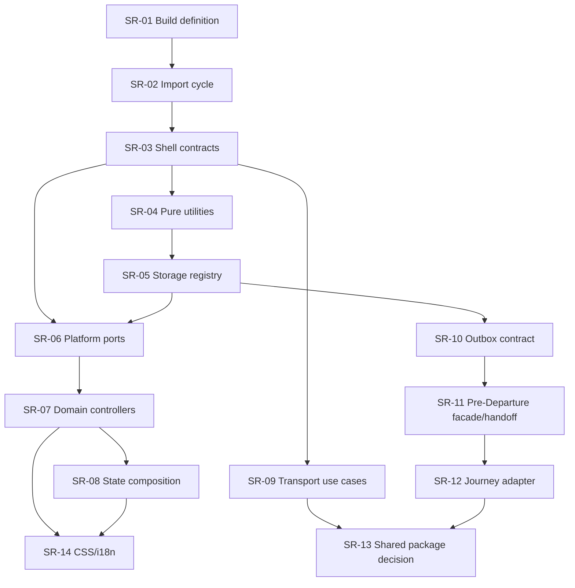

# AGM — MC-3B Structural Refactoring Roadmap

Date: 2026-07-28  
Increment: MC-3B — First Structural Extraction Plan  
Execution mode: analysis and planning only  
Production code changed: no  
Competition material: FROZEN AND PROTECTED

## 1. Executive decision

The recommended strategy is a sequence of small, independently reversible
interventions. The first implementation must not start with a state rewrite, CSS,
Outbox unification, After-Departure integration or `TransportsService` decomposition.

The first authorized implementation candidate is:

**SR-01 — Unify the Web build definition without changing its output.**

The first actual source-boundary extraction candidate is:

**SR-02 — Remove the known governance import cycle through a neutral type contract.**

This order first stabilizes how Browser assets are produced, then removes a proven
graph defect, and only afterwards introduces contracts needed to reduce `main.ts`.

## 2. Evidence used

- MC-0 baseline and contract registry;
- MC-2 architectural modularization analysis;
- MC-3A Characterization Shield;
- current read-only source inspection;
- current hashes and dependency graph;
- MC-3A Browser/API/Android test and build results.

Current measured hotspots:

| Component | Current size/state | Evidence |
|---|---:|---|
| `main.ts` | 4,687 lines; 65 characterized state fields | critical fan-out |
| `styles.css` | 4,467 lines | critical global styling hotspot |
| `TransportsService` | 531 lines | multiple backend responsibilities |
| Pre-Departure controller | 480 lines | UI, storage, sync and context |
| Pre-Departure Outbox | 161 lines | specialized active Outbox |
| After-Departure controller | 106 lines | isolated POC boundary |
| `@agm/shared` | one exported constant | no demonstrated consumers |
| Web build configuration | two active definitions | duplicated output contract |
| Web import graph | one known cycle | characterized by MC-3A |

## 3. Ordering principles

1. Production behavior and public contracts remain unchanged.
2. A prerequisite or low-risk boundary is treated before its consumers.
3. One intervention owns one architectural boundary.
4. Existing adapters remain available until parity is demonstrated.
5. Storage and Outbox changes require migration/recovery evidence before adoption.
6. Browser and Android parity is tested whenever shared WebView behavior is touched.
7. No file is deleted in the increment in which its replacement is introduced.
8. CSS and i18n follow markup/controller stabilization.
9. Premium continuity work follows common contracts; it does not create them ad hoc.
10. The MC-3A shield is mandatory before and after every intervention.

Effort scale:

- XS: up to one focused working session;
- S: one small increment;
- M: several focused increments;
- L: multi-increment change with separate gates;
- XL: program-level change, never authorized as a single diff.

## 4. Ordered structural interventions

### SR-01 — Single Web build definition

| Attribute | Decision |
|---|---|
| Purpose | Replace the duplicated entrypoint/plugin definition in `vite.config.mjs` and `scripts/build-web.mjs` with one shared build definition. |
| Priority reason | The real source still contains two definitions and different encoding. Every later Browser extraction depends on trustworthy build parity. |
| Benefit | One source of truth for the three entrypoints and HTML transform; eliminates configuration drift. |
| Impact | Build tooling only; no application runtime logic. |
| Risk | Low. Incorrect config loading could omit an entrypoint or change injected HTML. |
| Dependencies | MC-3A build, entrypoint and Browser smoke checks. |
| Effort | S. |
| Protected tests | `test:mc3a`, Web production build, HTTP 200 for all three entrypoints, E6 Browser shell, After-Departure tests. |
| Rollback | Point both build paths back to their previous inline definitions; no runtime/data rollback. |
| Acceptance | Identical entrypoint set, proxy behavior and navigation; UTF-8 text correct; Browser/Android build PASS; no output behavior change. |

### SR-02 — Neutral governance record contract and cycle removal

| Attribute | Decision |
|---|---|
| Purpose | Move only the shared `AgentGovernanceRecord` type boundary to a neutral contract module and make both governance modules depend on it. |
| Priority reason | MC-3A proved the cycle `agent-governance.registry.ts` ↔ `monitoring-department.ts`. Removing it makes the graph acyclic before broader module work. |
| Benefit | Deterministic module initialization and a clean ownership boundary. |
| Impact | Type/import structure only; rendered monitoring content must remain identical. |
| Risk | Low. Runtime risk exists if a type-only dependency is accidentally converted into a value dependency. |
| Dependencies | SR-01; current cycle baseline. |
| Effort | XS–S. |
| Protected tests | Import-cycle checker, MC-3A `main.ts` characterization, Web build, Browser smoke. |
| Rollback | Restore the two previous imports and known-cycle allowlist. |
| Acceptance | Web/API graphs report zero cycles; governance output and public exports unchanged. |

### SR-03 — App-shell contracts without logic movement

| Attribute | Decision |
|---|---|
| Purpose | Define composed `AppState`, `ViewModule` lifecycle and an explicit module registry compatible with the current renderer. |
| Priority reason | `main.ts` cannot be safely reduced until state, lifecycle and registration boundaries exist. |
| Benefit | Creates stable seams for later extractions without a rewrite. |
| Impact | Types and facade contracts; existing functions remain the active implementation. |
| Risk | Medium. A premature abstraction could encode the wrong lifecycle. |
| Dependencies | SR-01, SR-02; characterization of the 65 state fields and entrypoints. |
| Effort | M. |
| Protected tests | Entire Web MC-3A suite, view-entry smoke, Premium foundation, Android static baseline. |
| Rollback | Remove unused contracts/registry and retain the existing renderer as sole path. |
| Acceptance | All 65 current fields map exactly once to a named sub-state; registry has no side-effect loading; no consumer is switched without a separate gate. |

### SR-04 — Pure utilities and read-only clients from `main.ts`

| Attribute | Decision |
|---|---|
| Purpose | Extract, one by one, pure clipboard/text helpers and the health client; defer service-worker registration and storage mutation. |
| Priority reason | Smallest demonstrable reduction of `main.ts` with minimal lifecycle risk. |
| Benefit | Reduces fan-out and establishes the extraction procedure. |
| Impact | Internal imports only; UI, markup and state remain unchanged. |
| Risk | Low–medium. Browser capability differences and error handling must remain identical. |
| Dependencies | SR-03; function-level characterization for each selected helper. |
| Effort | M, split into separate XS/S changes. |
| Protected tests | `main.ts` characterization, translation/mail guard, Browser smoke, API health tests. |
| Rollback | Restore the local function and import call site; extracted file remains until later cleanup approval. |
| Acceptance | Byte-equivalent user-visible results and identical error messages; each extraction has its own parity evidence. |

### SR-05 — Storage Registry and repository boundaries

| Attribute | Decision |
|---|---|
| Purpose | Introduce a registry describing key, schema version, owner, retention and reset policy; then place OCR history and tutorial persistence behind repositories. |
| Priority reason | Direct storage access currently crosses domains and blocks safe state/controller extraction. |
| Benefit | Explicit data ownership and controlled future migrations. |
| Impact | Local Browser/Android persistence; no key rename or migration in the first increment. |
| Risk | High because update/restart persistence is user-visible. |
| Dependencies | SR-03, SR-04; storage/reset characterization expanded for affected keys. |
| Effort | L, delivered key family by key family. |
| Protected tests | Existing domain scripts, restart/restore tests, malformed-data recovery, Browser/Android persistence checks. |
| Rollback | Consumer returns to the direct existing key; no data deletion and no dual-write. |
| Acceptance | Same keys and serialized values; reset behavior unchanged; ownership complete; recovery from malformed data demonstrated. |

### SR-06 — Platform capability ports

| Attribute | Decision |
|---|---|
| Purpose | Put Voice, Email handoff, Diagnostics and Camera/OCR behind capability ports while retaining existing Browser/native adapters. |
| Priority reason | Domain controllers cannot become platform-neutral while calling concrete native/browser mechanisms. |
| Benefit | Explicit Browser/Android parity and controlled fallback behavior. |
| Impact | Cross-platform effects and permissions. |
| Risk | High/critical, especially voice, attachments and camera permissions. |
| Dependencies | SR-03–SR-05; device-level test matrix and adapter contracts. |
| Effort | L, one capability per authorized increment. |
| Protected tests | Mail send guard, Android plugin baseline/unit build, device permission tests, Browser fallback tests. |
| Rollback | Switch the facade binding to the former concrete adapter; old adapter is not deleted. |
| Acceptance | Same inputs, recipients, attachments, speech behavior, permissions and fallback; physical Android evidence for native capabilities. |

### SR-07 — Domain-controller strangler extraction from `main.ts`

| Attribute | Decision |
|---|---|
| Purpose | Extract Translator, Mail, Contacts, OCR and Incident controllers sequentially behind SR-03/SR-06 contracts. |
| Priority reason | These responsibilities are the largest removable functional clusters in the shell. |
| Benefit | Reduces shell state coupling and makes domain testing independent. |
| Impact | Browser and Android user flows. |
| Risk | High; each domain has render, bind, persistence and side effects. |
| Dependencies | SR-03–SR-06. |
| Effort | XL overall, but M per domain. |
| Protected tests | Domain-specific characterization plus full Web/Android regression after every domain. |
| Rollback | Route the module registry entry to the legacy shell implementation. Never run both implementations for writes. |
| Acceptance | One active implementation per domain; identical UI/behavior/storage; measurable reduction in `main.ts`; no markup change unless separately authorized. |

### SR-08 — Composed state store

| Attribute | Decision |
|---|---|
| Purpose | Replace the monolithic state gradually with domain state, selectors and commands; preserve a compatibility facade during migration. |
| Priority reason | State migration is unsafe before domain ownership and controller boundaries exist. |
| Benefit | Localized invalidation, testable transitions and reduced hidden coupling. |
| Impact | All primary views and persistence. |
| Risk | Critical. This is the highest frontend regression risk. |
| Dependencies | SR-03 and substantial completion of SR-07. |
| Effort | XL, split by state domain. |
| Protected tests | Full MC-3A, DOM/view characterization, storage restore/reset, Browser screenshots and Android device regression. |
| Rollback | Per-domain compatibility adapter returns reads/writes to legacy state; no big-bang switch. |
| Acceptance | Every state field has exactly one owner; selectors are deterministic; no cross-domain mutation; render parity demonstrated. |

### SR-09 — `TransportsService` use-case decomposition

| Attribute | Decision |
|---|---|
| Purpose | Separate transition policy, validation checks, audit/event interaction, finance, numbering and repository concerns behind the existing service API. |
| Priority reason | The external boundary is stable, but internal responsibilities are concentrated. Work can proceed independently after contract coverage is expanded. |
| Benefit | Smaller backend use cases and clearer transaction ownership. |
| Impact | API internals and database transaction behavior; no public API/schema change. |
| Risk | High due to audit consistency and transaction atomicity. |
| Dependencies | Existing 3-scenario characterization expanded to every lifecycle command and failure path. |
| Effort | L–XL. |
| Protected tests | Full API suite, OpenAPI/contract tests, lifecycle matrix, transaction rollback, audit/history identity and idempotency tests. |
| Rollback | Keep `TransportsService` facade and switch each command back to its legacy internal path. |
| Acceptance | HTTP/DTO/error compatibility; same transaction boundary; identical audit, validation and state history; Prisma schema untouched. |

### SR-10 — Common Outbox contract and controlled reconciliation

| Attribute | Decision |
|---|---|
| Purpose | Define common operation identity, idempotency, retry, conflict and acknowledgement semantics; adapt Pre-Departure and Operational Context without merging stored queues immediately. |
| Priority reason | Two active Outboxes have different ownership. Premature unification risks loss or duplicate delivery. |
| Benefit | One continuity contract while preserving specialized storage during transition. |
| Impact | Offline behavior, local persistence and sync. |
| Risk | Critical data-consistency risk. |
| Dependencies | SR-05; exhaustive semantic mapping; failure, quota, restart and multi-tab characterization. |
| Effort | XL. |
| Protected tests | Current Pre-Departure Outbox tests plus idempotency, duplicate, ordering, retry, crash recovery and conflict suites. |
| Rollback | Each producer returns to its existing Outbox adapter; no queue deletion or irreversible migration. |
| Acceptance | No lost/duplicate operation; deterministic replay; explicit ownership; migration rehearsal; no permanent dual-write. |

### SR-11 — Pre-Departure facade and Journey handoff

| Attribute | Decision |
|---|---|
| Purpose | Separate Pre-Departure UI, storage, sync and Operational Context integration; define a versioned handoff to Journey. |
| Priority reason | Pre-Departure is already modular and well tested; it should be changed only after common storage/continuity contracts stabilize. |
| Benefit | Clear lifecycle boundary and preparation for Hub integration. |
| Impact | Critical operational flow. |
| Risk | High. |
| Dependencies | SR-05, SR-10 and approved platform-neutral Operational Context contract. |
| Effort | L. |
| Protected tests | 18/18 transitions, issues, confirmation, report, outbox, sync API and Browser/Android journey tests. |
| Rollback | Existing controller facade remains selectable; handoff adapter can be disabled without altering session data. |
| Acceptance | Same Pre-Departure behavior; one owner per effect; handoff is versioned, idempotent and recoverable. |

### SR-12 — After-Departure to TripContext/Journey adapter

| Attribute | Decision |
|---|---|
| Purpose | Replace isolated POC state projection with an adapter to canonical TripContext and Operational Events. |
| Priority reason | It is a continuity integration, not an early cleanup; it depends on the stabilized handoff and Outbox semantics. |
| Benefit | One journey lifecycle and no isolated operational state. |
| Impact | After-Departure/Journey behavior and event continuity. |
| Risk | High. |
| Dependencies | SR-10, SR-11; platform-neutral Operational Context contract. |
| Effort | L. |
| Protected tests | Existing After-Departure tests plus handoff, event order, recovery and offline continuity. |
| Rollback | Keep the current local POC adapter available read-only and restore it as the selected source. |
| Acceptance | Same safe/unsafe/emergency presentation; deterministic TripContext projection; no duplicate events. |

### SR-13 — Controlled role for `@agm/shared`

| Attribute | Decision |
|---|---|
| Purpose | Decide and implement the package only when the first proven cross-package contract exists; otherwise retain it unchanged pending separate retirement authority. |
| Priority reason | Designing a shared package before actual consumers creates speculative coupling. |
| Benefit | Shared contracts follow demonstrated reuse rather than becoming a dumping ground. |
| Impact | Workspace package boundaries. |
| Risk | Medium. |
| Dependencies | Candidate contract demonstrated by SR-09–SR-12; dependency-direction decision. |
| Effort | M. |
| Protected tests | Package build/type tests and consumer contract tests. |
| Rollback | Keep contracts in their owning package and remove only the new consumer mapping; no deletion in the same increment. |
| Acceptance | Unique owner, version policy and at least two justified consumers; no infrastructure or framework dependencies. |

### SR-14 — CSS and i18n modularization

| Attribute | Decision |
|---|---|
| Purpose | Split global styles into tokens/base/domain layers and the dictionary into namespaces while preserving the current translation API. |
| Priority reason | Styling and translation structure should follow stabilized markup and domain ownership. |
| Benefit | Clear ownership, smaller change radius and complete language validation. |
| Impact | All visual surfaces and RO/DE/EN content. |
| Risk | High visual/accessibility risk. |
| Dependencies | SR-07/SR-08 stabilization; visual baseline and translation-key completeness checker. |
| Effort | XL, domain by domain. |
| Protected tests | Visual regression at desktop/narrow/Android sizes, accessibility smoke and RO/DE/EN completeness. |
| Rollback | Restore the domain import to the prior global bundle/dictionary namespace; do not delete legacy files until parity approval. |
| Acceptance | Pixel/semantic parity within approved tolerance; no missing key; deterministic cascade; bundle behavior unchanged. |

## 5. Dependency diagram

Parallelism is permitted only where dependency arrows do not intersect and each
stream has a different Accountable owner. In particular, SR-09 may proceed alongside
frontend SR-04–SR-08 after its lifecycle characterization is expanded.

## 6. Mandatory gate for every implementation increment

### Before change

1. Explicit mandate naming exactly one SR boundary.
2. Owner, validator and rollback operator named.
3. Exact files and consumers inventoried.
4. Baseline hashes recorded.
5. Relevant MC-3A tests PASS.
6. Additional missing characterization added first.
7. Browser/Android impact classified.
8. Competition-material scope confirmed excluded.

### After change

1. Targeted tests PASS.
2. Full MC-3A shield PASS.
3. API and Web builds PASS where applicable.
4. Browser parity PASS.
5. Android parity PASS when shared/native behavior is touched.
6. Import graph has no new cycles.
7. No functional or public-contract change.
8. No files deleted.
9. Protected hashes unchanged.
10. Diff, warnings and rollback evidence recorded.

Any failed mandatory item produces `STOP / NOT READY` for that intervention only.

## 7. Global rollback strategy

- Every intervention is isolated in its own checkpoint/commit after authorization.
- Consumers are switched through one explicit facade/registry binding.
- The legacy implementation remains intact until independent parity validation.
- Rollback changes the binding back; it does not transform stored production data.
- Storage migration, if later authorized, requires a pre-migration backup and a
  separately tested reverse/read-compatibility path.
- No permanent dual-write is allowed.
- Cleanup and file deletion require a later, independent mandate.

## 8. Explicit exclusions

This roadmap does not authorize:

- implementation of any SR item;
- production-code movement;
- Premium functionality;
- schema or data migration;
- deployment or infrastructure work;
- deletion of legacy files;
- changes to competition material;
- a big-bang rewrite of `main.ts`, state, Outbox, CSS or backend lifecycle.

## 9. Prioritization summary

| Order | Intervention | Impact | Risk | Effort |
|---:|---|---|---|---|
| 1 | SR-01 Single Web build definition | High enabling | Low | S |
| 2 | SR-02 Governance import-cycle removal | Medium enabling | Low | XS–S |
| 3 | SR-03 App-shell contracts | High enabling | Medium | M |
| 4 | SR-04 Pure utilities/read-only clients | Medium | Low–medium | M |
| 5 | SR-05 Storage Registry/repositories | High | High | L |
| 6 | SR-06 Platform capability ports | High | High/critical | L |
| 7 | SR-07 Domain-controller extraction | Very high | High | XL total |
| 8 | SR-08 Composed state store | Very high | Critical | XL |
| 9 | SR-09 Transport use-case decomposition | High | High | L–XL |
| 10 | SR-10 Common Outbox contract | Very high | Critical | XL |
| 11 | SR-11 Pre-Departure facade/handoff | High | High | L |
| 12 | SR-12 After-Departure/Journey adapter | High | High | L |
| 13 | SR-13 `@agm/shared` role decision | Medium | Medium | M |
| 14 | SR-14 CSS/i18n modularization | High maintainability | High | XL |

## 10. Recommendation for the next mandate

Authorize only:

**MC-3C / SR-01 — SINGLE WEB BUILD DEFINITION**

Required scope:

- one shared build-entry/plugin definition;
- both development and production build paths consume it;
- no change to runtime source, markup, API, storage, Android native code or CSS;
- entrypoint/build/smoke parity evidence;
- protected-material hash verification.

SR-02 and all later interventions remain unauthorized until SR-01 is independently
closed.

## 11. Verdict

**MC-3B PASS — STRUCTURAL REFACTORING ROADMAP READY FOR APPROVAL**

No refactoring, code movement, deletion, deployment or production modification was
performed during MC-3B.
