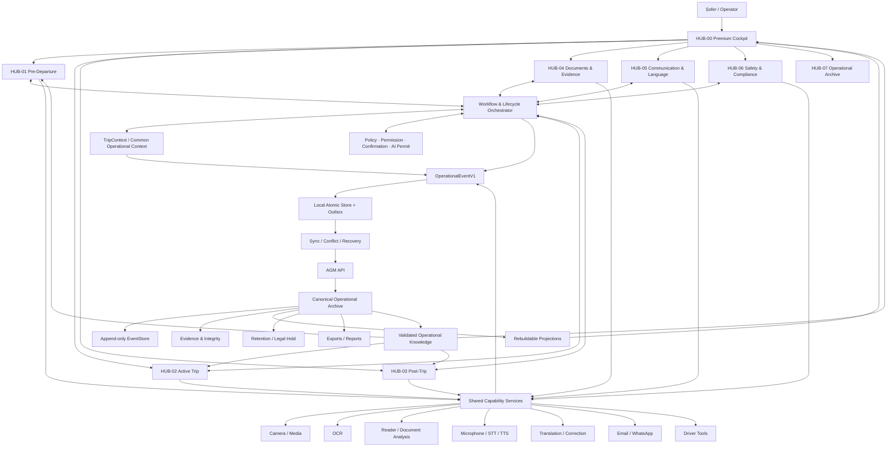

# AGM Premium – Viziune arhitecturală bazată pe Hub-uri Operaționale

Data: 2026-07-28  
Statut: **PROPUNERE CONCEPTUALĂ PENTRU VALIDARE STRATEGICĂ**  
Tip: arhitectură funcțională, fără implementare  
Impact cod/infrastructură/Production: niciunul

## 1. Sinteză executivă

AGM Premium trebuie construit ca un **sistem operațional continuu al cursei**, nu
ca o colecție de ecrane și funcții independente.

Arhitectura recomandată are patru elemente fundamentale:

1. **Hub-urile Operaționale** organizează activitatea utilizatorului;
2. **TripContext** păstrează starea unică și curentă a cursei;
3. **serviciile comune** oferă Camera, OCR, traducere, voce, analiză și
   comunicare tuturor Hub-urilor;
4. **Arhiva Operațională AGM** păstrează evenimentele, dovezile, deciziile,
   rapoartele și cunoașterea validată.

Formula arhitecturală:

```text
Hub = experiență + orchestrare contextuală
Serviciu = capabilitate reutilizabilă
TripContext = stare operațională unică
Arhivă = memorie canonică și auditabilă
```

Această direcție reutilizează fundația Premium deja aprobată:

- TripContext v1;
- lifecycle-ul cursei;
- OperationalEventV1;
- EventStore append-only;
- outbox, sync și recovery;
- optimistic concurrency;
- protecția împotriva stărilor paralele.

## 2. Viziunea AGM Premium

AGM Premium este copilotul operațional al șoferului pe întreaga durată a muncii:

```text
Pregătire
→ Plecare
→ Cursă activă
→ Evenimente și comunicare
→ Sosire
→ Închidere
→ Arhivă și reutilizarea cunoașterii
```

Utilizatorul nu „deschide module” fără context. El lucrează într-o cursă, într-un
incident, cu un document sau într-o conversație. AGM selectează capabilitățile
relevante și păstrează legăturile dintre ele.

Exemplu:

```text
Camera fotografiază un document
→ OCR extrage textul
→ utilizatorul verifică
→ analiza identifică obligații
→ traducătorul pregătește textul
→ Email/WhatsApp Assistant compune comunicarea
→ utilizatorul confirmă trimiterea
→ documentul, rezultatele și acțiunea sunt corelate în Arhivă
→ open item-ul rămâne vizibil până la rezolvare
```

## 3. Principiile de proiectare

### P1 – O singură cursă activă, un singur context

Toate Hub-urile consumă același `TripContextSnapshot` și trimit comenzi prin
serviciul comun. Niciun Hub nu modifică direct contextul și nu creează stare
globală paralelă.

### P2 – Hub-urile nu dețin copii ale datelor

Un Hub deține numai:

- reguli de orchestrare;
- proiecția necesară interfeței;
- comenzi permise;
- criterii de finalizare/handoff.

Datele canonice aparțin agregatelor și Arhivei.

### P3 – Serviciile comune sunt reutilizabile

Camera, OCR, microfonul, TTS, traducerea și analiza nu aparțin unui singur Hub.
Ele sunt capabilități folosite sub context și politici diferite.

### P4 – Originalul nu este suprascris

Se păstrează separat:

- documentul original;
- textul OCR;
- corecția umană;
- traducerea;
- analiza AI;
- mesajul trimis;
- versiunea și proveniența fiecărui rezultat.

### P5 – AI recomandă, omul confirmă

AI nu:

- confirmă plecarea;
- acceptă un risc;
- închide un incident;
- trimite automat o comunicare cu impact;
- modifică documentul original;
- arhivează o cursă incompletă.

### P6 – Offline este stare normală

Orice acțiune permisă offline este salvată atomic împreună cu evenimentul și
outbox-ul. UI diferențiază:

- salvat local;
- în așteptare;
- sincronizat;
- conflict;
- recovery required.

### P7 – Orice transfer este explicit

Un open item, warning, incident sau document este transferat prin:

```text
handoff.created → handoff.received
```

Lipsa recepției păstrează elementul deschis.

### P8 – Arhiva este append-only la nivel de eveniment

Corectarea nu rescrie trecutul. Produce un eveniment `corrected`, `revoked` sau
`redacted`, legat cauzal de original.

### P9 – Acces minim și retenție declarată

Fiecare tip de date are:

- clasificare;
- scop;
- owner;
- acces;
- retenție;
- condiții de export;
- condiții de distrugere.

### P10 – Extindere prin contract, nu prin cuplare

Un Hub nou se conectează prin comenzi, evenimente, proiecții și capabilități
versionate. Nu modifică direct baza internă a altui Hub.

## 4. Modelul integrat pe straturi

```text
┌────────────────────────────────────────────────────────────────────┐
│ EXPERIENȚĂ: AGM PREMIUM COCKPIT                                    │
│ navigare contextuală · stare · alerte · acțiuni · confirmări       │
├────────────────────────────────────────────────────────────────────┤
│ HUB-URI OPERAȚIONALE                                                │
│ Cockpit │ Pre-Departure │ Active Trip │ Post-Trip                  │
│ Documents & Evidence │ Communication │ Safety & Compliance         │
│ Operational Archive                                                │
├────────────────────────────────────────────────────────────────────┤
│ ORCHESTRARE ȘI POLITICI                                             │
│ Trip Lifecycle · Workflow · Handoff · Incident · Permission        │
│ Confirmation · AI Permit · Entitlement Premium · Rules             │
├────────────────────────────────────────────────────────────────────┤
│ CONTEXT OPERAȚIONAL COMUN                                           │
│ TripContext · Driver · Vehicle · Trailer · Cargo · Open Items       │
│ Warnings · Incidents · Confirmations · Operational Flags           │
├────────────────────────────────────────────────────────────────────┤
│ SERVICII COMUNE                                                     │
│ Camera/Media │ OCR │ Document Reader │ Document Analysis            │
│ Microphone/STT │ TTS │ Translation │ Email │ WhatsApp              │
│ Driver Tools │ Search │ Export │ Notifications                     │
├────────────────────────────────────────────────────────────────────┤
│ ARHIVA OPERAȚIONALĂ AGM                                             │
│ EventStore │ EvidenceIndex │ Integrity │ Retention │ ExportRegistry │
│ Projections │ Operational Knowledge                                │
├────────────────────────────────────────────────────────────────────┤
│ PORTURI ȘI ADAPTOARE                                                │
│ Local Store │ Outbox │ Sync │ Recovery │ AGM API │ AI Providers     │
│ Android Native │ Browser │ Email/WhatsApp clients │ Storage         │
└────────────────────────────────────────────────────────────────────┘
```

## 5. Hub-urile Operaționale

## HUB-00 – AGM Premium Cockpit

### Rol

Este punctul unic de intrare și orchestratorul experienței. Nu deține date de
business.

### Afișează

- cursa activă;
- starea lifecycle;
- următoarea acțiune recomandată;
- open items;
- warnings și incidente;
- sincronizarea;
- ultimele documente și comunicări;
- acces contextual la Hub-uri.

### Reguli

- nu dublează ecranele Hub-urilor;
- nu modifică direct agregatele;
- nu ascunde stările `BLOCKED`, `SYNC_PENDING` sau `RECOVERY_REQUIRED`;
- continuă exact din ultima stare validă.

## HUB-01 – Pre-Departure

### Rol

Pregătește cursa până la:

- `READY_CONFIRMED`;
- `READY_WITH_WARNINGS`;
- `BLOCKED`.

### Integrează

- șofer;
- vehicul și remorcă;
- documente obligatorii;
- încărcătură și Ladungssicherung;
- tahograf, timp și reguli;
- checklist;
- dovezi;
- confirmare umană.

### Transfer

Predă Active Trip:

- contextul confirmat;
- avertismente acceptate;
- restricții;
- sarcini;
- incidente;
- documentele relevante.

## HUB-02 – Active Trip

### Rol

Coordonează cursa dintre plecare și sosire.

### Integrează

- navigarea și contextul curent;
- evenimente de traseu;
- timpi și opriri;
- incidente;
- comunicare;
- documente primite;
- fotografii și dovezi;
- instrumente șofer;
- escaladare.

### Reguli

- nu închide automat incidente;
- permite lucru offline;
- prioritizează siguranța și acțiunile urgente;
- păstrează legătura cu warning-urile Pre-Departure.

## HUB-03 – Post-Trip

### Rol

Închide controlat cursa.

### Integrează

- sosire;
- documente finale;
- open items;
- confirmări;
- incidente transferate;
- raportul final;
- sincronizare;
- pregătirea pentru arhivare.

### Reguli

Nu permite `ARCHIVED` dacă există:

- `SYNC_PENDING`;
- `RECOVERY_REQUIRED`;
- conflict;
- dovadă critică lipsă;
- incident fără dispoziție;
- manifest fără integritate.

## HUB-04 – Documents & Evidence

### Rol

Administrează ciclul documentului și al dovezii, indiferent de etapa cursei.

### Flux

```text
Capture/Import
→ Classification
→ OCR proposal
→ Human review
→ Structured extraction
→ Analysis
→ Link to Trip/Incident/Task
→ Retention and access
```

### Integrează

- Camera;
- galerie/import;
- OCR;
- cititor documente;
- analiză documente;
- corectare;
- traducere;
- semnături/hash;
- evidence manifest.

### Reguli

- OCR este propunere până la verificare;
- documentul original rămâne imuabil;
- analiza declară modelul, regulile și limitările;
- accesul la fișiere este separat de accesul la metadate.

## HUB-05 – Communication & Language

### Rol

Transformă contextul operațional în comunicare verificabilă.

### Integrează

- Traducător;
- Microfon și speech-to-text;
- citire vocală;
- corectare;
- Email Assistant;
- WhatsApp Assistant;
- șabloane;
- contacte;
- comunicări legate de documente și incidente.

### Obiect canonic

`CommunicationDraft` conține:

- scop;
- destinatar;
- canal;
- text original;
- traducere;
- surse contextuale;
- atașamente;
- stare `draft/reviewed/handed-off/sent-confirmed/failed`;
- actor și timp;
- provider/proveniență.

### Reguli

- AGM pregătește și predă mesajul clientului extern;
- `handed-off` nu înseamnă `delivered`;
- livrarea este declarată numai când există dovadă;
- utilizatorul confirmă conținutul și destinatarul;
- originalul și traducerea rămân legate.

## HUB-06 – Safety & Compliance

### Rol

Corelează verificările de siguranță, regulile, avertismentele și obligațiile.

### Integrează

- Ladungssicherung;
- vehicul și remorcă;
- tahograf și timp;
- legislație/conformitate;
- documente obligatorii;
- incidente de siguranță;
- explicații și recomandări AI;
- confirmări umane.

### Reguli

- recomandarea nu este decizie juridică finală;
- regulile sunt versionate și legate de jurisdicție/timp;
- un risc critic poate seta `BLOCKED`;
- acceptarea warning-ului păstrează motivul și actorul;
- nicio confirmare nu este generată de AI.

## HUB-07 – Operational Archive

### Rol

Este memoria canonică, auditabilă și reconstructibilă a AGM Premium.

Nu este doar o pagină de istoric. Este infrastructura logică din care se
reconstruiesc timeline-uri, rapoarte, dovezi și cunoaștere.

Componentele sale sunt definite în secțiunea următoare.

## 6. Arhiva Operațională AGM

## 6.1 Structura recomandată

```text
OperationalArchive
├── Canonical EventStore
├── Evidence Registry
│   ├── metadata
│   ├── content hash
│   ├── storage reference
│   └── access/retention
├── Projection Store
│   ├── Trip Timeline
│   ├── Document Timeline
│   ├── Communication Timeline
│   ├── Incident Timeline
│   ├── Confirmation Ledger
│   ├── Sync/Recovery Timeline
│   └── Hub Views
├── Integrity Registry
├── Retention & Legal Hold Registry
├── Export Registry
└── Operational Knowledge
    ├── validated templates
    ├── terminology
    ├── resolved patterns
    ├── lessons learned
    └── reusable procedures
```

## 6.2 Surse de adevăr

| Informație | Sursa canonică |
|---|---|
| starea curentă a cursei | Trip aggregate / TripContext validat |
| istoricul schimbărilor | EventStore |
| fișierul original | storage autorizat + Evidence Registry |
| text OCR | rezultat versionat, nu documentul |
| traducere | TranslationResult cu proveniență |
| mesaj | CommunicationDraft/CommunicationEvent |
| incident | Incident aggregate + evenimente |
| raport | export versionat + manifest |
| ecran Hub | proiecție reconstruibilă |
| lecție reutilizabilă | Operational Knowledge, după validare |

## 6.3 Operational Knowledge

Arhiva poate deveni nucleu de cunoaștere numai printr-un proces controlat:

```text
evenimente/dovezi
→ caz închis
→ analiză
→ lecție propusă
→ validare umană
→ clasificare și anonimizare
→ publicare ca resursă reutilizabilă
```

Nu se recomandă antrenarea sau reutilizarea automată a datelor brute ale
utilizatorului. Cunoașterea reutilizabilă trebuie să fie:

- minimizată;
- separată de identitatea cursei;
- aprobată;
- versionată;
- revocabilă;
- legată de sursa și limita ei.

## 6.4 Căutare și reconstituire

Arhiva trebuie să permită:

- căutare per cursă/document/incident/comunicare;
- timeline causal;
- reconstrucția proiecțiilor;
- exporturi cu scop limitat;
- verificarea hash-urilor;
- identificarea corecțiilor;
- diferențierea dintre original și derivat;
- explicarea rezultatului fără a expune secrete.

## 7. Serviciile comune

| Serviciu | Intrare | Rezultat | Consumatori |
|---|---|---|---|
| Media Capture | cameră/import + context | MediaRef + hash | Documents, Safety, Active Trip |
| OCR | MediaRef + tip document | OcrProposal | Documents, Communication |
| Document Reader | document/text verificat | redare accesibilă | toate Hub-urile autorizate |
| Document Analysis | document + scop + reguli | findings/warnings/tasks | Documents, Safety, Post-Trip |
| Microphone/STT | audio + locale + consimțământ | transcript propus | Communication, Active Trip |
| TTS | text + locale | redare vocală | Cockpit, Communication, Documents |
| Translation | original + limbi + scop | TranslationResult | toate Hub-urile |
| Text Correction | text + limbă + scop | corrected proposal | Communication, Documents |
| Email Assistant | CommunicationDraft | handoff către client e-mail | Communication |
| WhatsApp Assistant | CommunicationDraft | handoff/deep link autorizat | Communication |
| Driver Tools | context + instrument | rezultat contextual | Pre, Active, Post |
| Notifications | eveniment + policy | alertă/acțiune | Cockpit și Hub relevant |
| Search | query + access scope | rezultate/proiecții | Cockpit, Archive |
| Export | scope + authorization | artefact + manifest | Archive, Post-Trip |

### Regula serviciilor

Serviciul:

- nu schimbă singur lifecycle-ul;
- nu deține UI operațională completă;
- nu păstrează o copie paralelă a contextului;
- returnează rezultat versionat și evenimente;
- declară online/offline/fallback;
- aplică accesul și minimizarea.

## 8. Contextul Operațional Comun

TripContext rămâne coloana vertebrală.

```text
TripContext
├── identity/version
├── lifecycle
├── operational flags
├── driver/vehicle/trailer/cargo
├── current location/time context
├── open items
├── warnings/incidents
├── confirmations
├── transferred results
├── last server version
└── last canonical event
```

### ContextScope

Pentru folosirea funcțiilor în afara unei curse se recomandă:

```text
ContextScope =
  TripScope
  | DocumentScope
  | IncidentScope
  | CommunicationScope
  | StandaloneToolScope
```

`StandaloneToolScope` permite traduceri sau instrumente rapide, dar rezultatul nu
este asociat retroactiv unei curse fără o comandă explicită și auditată.

## 9. Fluxul informațional

## 9.1 Flux de comandă

```text
Utilizator
→ Hub
→ policy/permission/expectedVersion
→ command
→ TripContext/domain service
→ rezultat + OperationalEvent
→ local atomic save + outbox
→ proiecție Hub
→ sync server
→ ack/conflict/recovery
```

## 9.2 Flux de captură și document

```text
Camera/Import
→ MediaRef + hash
→ Evidence Registry
→ OCR proposal
→ Human review
→ Document aggregate
→ Analysis/Translation/Reader
→ findings/tasks/communication
→ canonical events
→ Archive projections
```

## 9.3 Flux de comunicare

```text
Trip/Document/Incident context
→ CommunicationDraft
→ correction/translation
→ human review
→ Email or WhatsApp handoff
→ handoff event
→ delivery evidence if available
→ timeline and open-item update
```

## 9.4 Flux de incident

```text
Detection
→ incident.opened
→ severity + affected scope
→ evidence and communication
→ action/handoff
→ resolution proposal
→ human/authorized closure
→ lesson candidate
→ validated Operational Knowledge
```

## 9.5 Flux între Hub-uri

Hub-urile nu își trimit payload-uri private direct. Transferul folosește:

- referințe canonice;
- evenimente;
- open items;
- handoff IDs;
- correlation/causation IDs;
- proiecții autorizate.

## 10. Diagrama conceptuală completă



## 11. Lifecycle integrat

```text
DRAFT
→ PRE_DEPARTURE_IN_PROGRESS
→ READY_CONFIRMED | READY_WITH_WARNINGS | BLOCKED
→ TRIP_ACTIVE
→ ARRIVAL_RECORDED
→ POST_TRIP_IN_PROGRESS
→ COMPLETED
→ ARCHIVED
```

Flaguri ortogonale:

- `OFFLINE`;
- `SYNC_PENDING`;
- `INCIDENT_OPEN`;
- `BLOCKED`;
- `RECOVERY_REQUIRED`.

Maparea cu `TransportJob` rămâne un adaptor versionat. Lifecycle-ul Premium nu
trebuie redefinit pentru a copia codurile backendului.

## 12. Avantajele arhitecturii

### Integrare reală

Funcțiile folosesc același context, documente, incidente și timeline.

### Reutilizare

Un singur OCR, traducător sau serviciu voce deservește toate Hub-urile.

### Continuitate

Open items și handoff-urile supraviețuiesc schimbării ecranului sau etapei.

### Offline și mobil

Modelul outbox/ack/conflict este compatibil cu activitatea șoferului.

### Audit și încredere

Originalul, rezultatele AI, confirmările și comunicările rămân distincte.

### Scalabilitate funcțională

Servicii și Hub-uri noi pot fi adăugate prin contracte versionate.

### Scalabilitate organizațională

Fiecare Hub/serviciu poate primi service owner fără crearea unui departament nou.

## 13. Limitări și riscuri

### Complexitatea event-driven

EventStore, proiecțiile și versionarea sunt mai complexe decât CRUD direct.

Control:

- contracte mici;
- tooling pentru inspectarea evenimentelor;
- teste de replay și migrare.

### Arhiva poate crește rapid

Media, OCR și evenimentele produc volum.

Control:

- retenție per clasă;
- fișiere separate de evenimente;
- HOT/WARM/COLD;
- minimizare și deduplicare.

### Proiecțiile pot întârzia

UI poate vedea o proiecție în urmă față de eveniment.

Control:

- afișarea versiunii/sync;
- read-your-write local;
- recovery determinist.

### AI poate produce rezultate incerte

Control:

- proveniență;
- confidence;
- human review;
- permit;
- păstrarea originalului.

### Integrarea Email/WhatsApp nu confirmă automat livrarea

Control:

- stări separate `handed-off` și `delivered`;
- dovada canalului, unde este disponibilă;
- text UX explicit.

### Risc de supraîncărcare a Cockpitului

Control:

- progresive disclosure;
- o singură „next best action”;
- alerte prioritizate;
- Hub-uri cu responsabilitate clară.

## 14. Etapele de implementare

## Etapa 0 – Validarea direcției

Livrabile:

- aprobarea Hub-urilor;
- ADR pentru limitele Hub/serviciu;
- registrul inițial Hub-uri și capabilități;
- criteriile MVP.

Fără cod.

## Etapa 1 – Închiderea fundației comune

Se finalizează condițiile deschise ale Etapei 3:

- adaptor EventStore server;
- politici reale de acces;
- proiecție UI comună;
- sync/recovery end-to-end;
- schema și versiunea evenimentelor.

Poartă: replay, offline, conflict și recovery PASS.

## Etapa 2 – Premium Cockpit MVP

Include:

- HUB-00;
- cursa activă;
- lifecycle;
- open items;
- flags;
- navigare contextuală;
- timeline minimal.

Nu migrează încă toate funcțiile.

## Etapa 3 – Documents & Evidence vertical slice

Include:

- Camera/import;
- Evidence Registry;
- OCR;
- review uman;
- document original/derivat;
- citire;
- analiză;
- evenimente și proiecție.

Acesta este primul flux complet de la captură la arhivă.

## Etapa 4 – Communication & Language

Include:

- traducere;
- corectare;
- microfon/STT;
- TTS;
- CommunicationDraft;
- Email Assistant;
- WhatsApp Assistant;
- handoff și stările livrării.

## Etapa 5 – Pre-Departure complet

Migrare controlată:

- vehicul/remorcă;
- documente;
- Ladungssicherung;
- tahograf/reguli;
- READY gate;
- handoff spre Active Trip.

## Etapa 6 – Active Trip și Driver Tools

Include:

- evenimente traseu;
- incidente;
- comunicare contextuală;
- instrumente șofer;
- utilizare offline extinsă;
- notificări.

## Etapa 7 – Post-Trip și Arhivă

Include:

- sosire;
- open-item disposition;
- raport final;
- manifests;
- retenție;
- archive sealing;
- exporturi.

## Etapa 8 – Operational Knowledge

Include:

- lecții propuse;
- validare;
- anonimizare;
- șabloane;
- terminologie;
- căutare și reutilizare.

Nu include învățare automată din date brute.

## Etapa 9 – Premium productization

Include:

- entitlement;
- planuri/licențe;
- feature flags;
- limite;
- cost controls;
- suport și observabilitate;
- onboarding Premium.

## Etapa 10 – Hub-uri pentru companie și flotă

Extensie posibilă:

- Fleet Operations Hub;
- Dispatch Hub;
- Compliance Hub organizațional;
- Customer/Partner Hub;
- Analytics Hub.

Acestea consumă aceleași evenimente și proiecții autorizate; nu creează o a doua
arhivă canonică.

## 15. MVP recomandat

MVP-ul nu trebuie să conțină toate funcțiile.

MVP recomandat:

1. HUB-00 Premium Cockpit;
2. TripContext și lifecycle;
3. HUB-04 Documents & Evidence;
4. Camera → OCR → review → document;
5. traducere și citire document;
6. un CommunicationDraft cu Email handoff;
7. EventStore local/server și timeline;
8. offline/outbox/recovery;
9. un raport minimal al cursei.

De ce acest MVP:

- demonstrează integrarea Hub–servicii–context–arhivă;
- reutilizează funcțiile existente;
- produce valoare reală;
- validează cea mai dificilă fundație;
- evită simularea unei platforme complete.

## 16. Evoluția pe termen lung

Arhitectura poate evolua ani de zile fără reorganizare majoră dacă sunt respectate
următoarele reguli:

1. Hub-urile noi declară manifest și contract;
2. serviciile noi intră în registry;
3. evenimentele sunt versionate;
4. proiecțiile sunt reconstruibile;
5. nicio funcție nu ocolește TripContext/Archive;
6. identitatea utilizatorului, organizației și Hub-ului este explicită;
7. multi-tenant se adaugă la acces și scope, nu prin baze paralele necontrolate;
8. regulile și AI permits sunt versionate;
9. retenția nu este hard-codată;
10. Basic rămâne compatibil prin adaptoare, nu prin duplicarea logicii.

### Extensii fără reorganizare

- noi instrumente șofer;
- limbi noi;
- noi tipuri de document;
- noi canale de comunicare;
- noi reguli și jurisdicții;
- Hub-uri companie/flotă;
- analytics;
- parteneri;
- noi provideri AI;
- noi platforme client.

### Schimbări care ar necesita versiune arhitecturală nouă

- mai multe surse canonice de evenimente;
- autonomie totală a Hub-urilor;
- colaborare multi-organizație cu ownership separat;
- automatizări care iau decizii critice fără om;
- eliminarea TripContext ca agregat de coordonare;
- schimbarea fundamentală a modelului de identitate/tenant.

## 17. Decizii arhitecturale recomandate

### ADR-PREM-01

Hub-urile sunt orchestratoare și experiențe, nu depozite de date.

### ADR-PREM-02

TripContext este contextul operațional unic al cursei.

### ADR-PREM-03

Operational Archive este sursa canonică a evenimentelor Premium.

### ADR-PREM-04

Camera, OCR, vocea, traducerea, analiza și comunicarea sunt servicii comune.

### ADR-PREM-05

Originalul și rezultatele derivate sunt entități separate și versionate.

### ADR-PREM-06

Email/WhatsApp handoff este diferit de confirmarea livrării.

### ADR-PREM-07

Offline/outbox/recovery este parte din domeniu, nu un detaliu UI.

### ADR-PREM-08

Operational Knowledge conține numai cunoaștere validată și controlată.

### ADR-PREM-09

Premium se extinde prin registrul Hub-urilor și serviciilor.

### ADR-PREM-10

Hub-urile viitoare de flotă și companie folosesc aceeași Arhivă prin proiecții
autorizate.

## 18. Recomandările finale ale echipei

1. Se reconfirmă direcția Premium bazată pe Hub-uri Operaționale.
2. Se păstrează fundația TripContext/EventStore deja aprobată.
3. Se construiește mai întâi un vertical slice complet, nu toate ecranele.
4. Documents & Evidence este cel mai bun prim Hub funcțional.
5. Communication devine un flux trasabil, nu trei instrumente separate.
6. Camera, OCR, vocea și traducerea rămân servicii comune.
7. Arhiva separă evenimentul, dovada, proiecția și cunoașterea reutilizabilă.
8. Operational Knowledge necesită validare umană și minimizare.
9. Premium Cockpit afișează context și acțiuni, fără a duplica Hub-urile.
10. Hub-urile pentru flotă/companie se adaugă numai după stabilizarea fluxului
    șoferului.
11. Fiecare etapă livrează un flux end-to-end cu offline, audit și recovery.
12. Nu se începe implementarea până la aprobarea ADR-urilor și a MVP-ului.

## 19. Concluzie strategică

Direcția recomandată este:

```text
AGM Premium =
Premium Cockpit
+ Hub-uri Operaționale
+ Context Operațional Comun
+ Servicii Comune
+ Arhivă Operațională Canonică
+ Cunoaștere Validată
```

Modelul integrează funcțiile existente, susține Premium, permite Hub-uri viitoare
și poate evolua pe termen lung fără reorganizări majore, cu condiția păstrării
contractelor, a sursei canonice unice și a separării dintre original, rezultat,
decizie și dovadă.

**Recomandare: DIRECȚIE ARHITECTURALĂ VALIDĂ PENTRU APROBARE STRATEGICĂ.**

