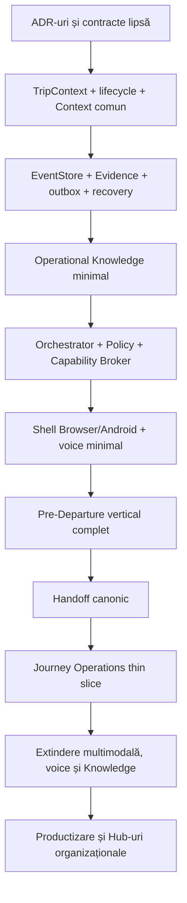

# AGM Premium — Workshop de arhitectură pentru Hub-urile Operaționale

Data: 2026-07-28  
Tip: workshop multidisciplinar și sinteză strategică  
Regim: analiză; fără implementare și fără modificarea documentelor canonice  
Obiect: `HUB-01 Pre-Departure` și `Journey Operations Workspace`

## 1. Scop și metodă

Workshop-ul a urmărit identificarea celei mai robuste soluții, nu confirmarea
automată a variantei existente. Perspectivele au fost colectate independent și
apoi comparate:

1. Product & Portfolio, Product Owner, Frontend și UX/Voice;
2. Architecture Guardian, Technical Lead, Backend & Data și AI & Localization;
3. Independent Assurance, Operations & Reliability, Security, Knowledge &
   Documentation și Monitoring.

Sinteza păstrează diferențele dintre propuneri și separă:

- consensul;
- propunerile distinctive;
- deciziile care necesită Change Control;
- recomandarea comună propusă pentru aprobare.

## 2. Concluzie executivă

Toate perspectivele resping modelul „Hub = pagină cu butoane”. Soluția comună
este:

> Două workspace-uri orientate pe obiective operaționale, construite peste un
> singur nucleu de date, evenimente, cunoaștere, politici și servicii comune.

Structura propusă:

- **HUB-01 Pre-Departure** conduce pregătirea până la `READY_CONFIRMED`,
  `READY_WITH_WARNINGS` sau `BLOCKED`;
- **Journey Operations Workspace** oferă o singură experiență după plecare, dar
  păstrează intern fazele distincte `Active Trip` și `Post-Trip`;
- `Documents & Evidence`, Communication, Camera, OCR, vocea și AI sunt
  capabilități transversale orchestrate, nu destinații obligatorii pentru
  utilizator;
- primul flux complet este validat direct în Pre-Departure;
- un al doilea flux subțire validează continuitatea în Journey Operations;
- vocea minimă intră în MVP, cu model `voice-first, screen-confirmed,
  driving-safe`;
- Arhiva este separată logic în Operational Memory și Validated Operational
  Knowledge;
- AI asistă analiza și recomandarea, dar nu controlează lifecycle-ul și nu
  execută singur acțiuni critice.

Strategia comună:

**HYBRID · CONTRACT-FIRST · JOURNEY-SLICE-FIRST**

## 3. Pozițiile departamentelor și rolurilor

| Departament/rol | Propunerea distinctivă | Condiție principală |
| --- | --- | --- |
| Product & Portfolio | Două workspace-uri percepute ca experiențe complete; succes măsurat prin rezultat, timp și număr de acțiuni | Fără expunerea structurii tehnice utilizatorului |
| Product Owner | Prima valoare trebuie demonstrată direct în Pre-Departure, nu într-un Hub tehnic intermediar | Scenariu utilizator end-to-end |
| Frontend & Website Owner | Shell comun Browser/Android, o acțiune principală, progressive disclosure și continuitate vizuală | Același model de stare pe ambele suprafețe |
| UX/Voice | Vocea minimă intră în MVP; interacțiunea este voice-first, screen-confirmed și safety-aware | Fallback complet pe ecran |
| Architecture Guardian | Două experiențe peste același nucleu; boundary-uri stricte; Active Trip și Post-Trip rămân distincte intern | Fără copii de date și fără lifecycle paralel |
| Technical Lead | Modular monolith inițial, workflow-uri versionate, integrare prin comenzi/evenimente și vertical slices | Fără microservicii premature |
| Backend & Data Custodian | `TripContext`, EventStore, outbox, idempotency, recovery și proiecții înaintea efectelor operaționale | O singură scriere canonică |
| AI & Localization Owner | AI controlat prin `Decision Envelope`; terminologie operațională și fallback fără AI | AI nu devine autoritate |
| Independent Assurance | Gate-uri pe proveniență, control uman, offline/recovery, driving-safe și reconstrucția completă a fluxului | Niciun efect critic neauditabil |
| QA & Validation | Acceptare pe fluxuri complete în Browser și Android, inclusiv erori și reluare | Nu se acceptă doar componente izolate PASS |
| Legal & Compliance | Surse, jurisdicție, valabilitate, retenție și avertismente explicite | Knowledge neverificat nu devine canonic |
| Operations & Reliability | Idempotency, receipts, mod degradat, recovery și rollback operațional | AI/cloud indisponibil nu blochează funcția esențială |
| Security, Secrets & Compliance | Minimizare, RBAC, redaction, controlul audio și protecția confirmărilor vocale | Fără date sensibile nejustificate în AI/loguri |
| Data Accountable | Separare Operational Memory/Knowledge și politici de retenție pe categorii | Fără arhive concurente |
| Knowledge & Documentation | Workflow candidat–review–aprobare–publicare–revizuire/retragere | AI nu publică singur cunoaștere |
| Monitoring | Trace per workflow, correlation IDs, metrici de rezultat și alerte pe efecte eșuate | Starea se bazează pe probe reale |

## 4. Propunerea Product, Frontend și UX/Voice

### 4.1 Modelul de produs

Produsul trebuie organizat în jurul scopurilor utilizatorului:

- „verifică dacă pot pleca”;
- „verifică documentul”;
- „raportează problema”;
- „contactează dispeceratul”;
- „înregistrează sosirea”;
- „închide cursa”.

Utilizatorul nu selectează Camera, OCR sau Traducere. Hub-ul deduce serviciile
necesare din intenție, `TripContext` și starea workflow-ului.

### 4.2 Experiența la deschidere

Hub-ul afișează:

1. situația curentă într-o propoziție;
2. principalul risc sau blocaj;
3. o singură acțiune recomandată;
4. posibilitatea de a întreba vocal;
5. acces secundar la detalii și istoric.

Exemplu:

> Cursa spre Nürnberg este pregătită în proporție de 80%. Lipsește verificarea
> documentului de încărcare. Îl fotografiem acum?

După fiecare operație, Hub-ul prezintă rezultatul și pasul următor, fără ca
utilizatorul să caute următorul modul.

### 4.3 Poziția față de MVP

Product propune:

- primul vertical slice direct în Pre-Departure;
- un slice minimal Journey Operations în același MVP extins;
- voice shell minimal încă de la prima validare;
- Email ca primul canal real;
- WhatsApp și conversația multi-turn avansată ulterior.

### 4.4 Metrici de produs

- timpul până la `READY`;
- numărul median de acțiuni manuale;
- procentul câmpurilor reintroduse;
- rata corecțiilor OCR;
- procentul fluxurilor reluate cu succes după offline;
- comunicări confirmate versus eșuate;
- incidente rezolvate;
- abandonul pe pas;
- intervențiile manuale evitate fără pierderea controlului.

## 5. Propunerea Engineering și Architecture

### 5.1 Formula arhitecturală

```text
Hub = obiectiv operațional + proiecție contextuală + orchestrare
Serviciu comun = capabilitate reutilizabilă
TripContext = identitatea și starea unică
Context Operațional Comun = proiecția situației curente
Operational Memory = faptele și dovezile
Operational Knowledge = cunoașterea validată
AI = analiză și recomandare controlată
```

### 5.2 Fluxul tehnic

```text
Voce / ecran / eveniment
        ↓
IntentEnvelope
        ↓
TripContext + Common Operational Context
        ↓
Policy / Safety / Permission Engine
        ↓
Workflow Orchestrator
        ↓
Archive-first retrieval
        ↓
Capability Broker
        ├── Camera / OCR / review
        ├── documente / analiză / traducere
        ├── STT / TTS
        ├── AI
        └── CommunicationDraft / Email / WhatsApp
        ↓
Decision Envelope
        ↓
Confirmare proporțională cu riscul
        ↓
Domain command
        ↓
EventStore + outbox + projections + Archive
```

### 5.3 Componente noi recomandate

#### Capability Broker

Hub-ul solicită o capabilitate, nu apelează un furnizor:

> „Extrage text verificabil din această dovadă.”

Brokerul selectează adaptorul aprobat, declară disponibilitatea și returnează un
rezultat versionat.

#### Decision Envelope

Orice recomandare semnificativă conține:

- propunerea;
- sursele;
- confidence;
- risc;
- acțiunile permise;
- confirmarea necesară;
- valabilitatea/expirarea;
- proveniența modelului sau regulii.

#### Operational Case / Task Graph

Operațiunile sunt modelate ca situații cu:

- scop;
- owner;
- stare;
- intrări;
- dovezi;
- blocaje;
- task-uri;
- handoff;
- rezultat.

Această abordare este mai flexibilă decât o succesiune rigidă de ecrane și
permite reluarea exactă după întrerupere.

### 5.4 Formă de implementare

Engineering recomandă inițial un **modular monolith** cu limite clare, evenimente
interne și porturi/adaptoare. Separarea în servicii fizice se justifică ulterior
prin cerințe de scalare, securitate sau operare, nu prin anticipare.

## 6. Propunerea Assurance, Operations, Security, Knowledge și Monitoring

### 6.1 Principiul de control

```text
Intent / eveniment
→ context versionat
→ reguli și politici
→ Knowledge validat
→ servicii
→ AI unde aduce valoare
→ verificare proporțională cu riscul
→ efect
→ eveniment, dovadă și proveniență
```

Automatizarea este acceptată numai când efectul rămâne:

- explicabil;
- auditabil;
- idempotent;
- recuperabil;
- securizat;
- controlabil de utilizator.

### 6.2 Confirmări proporționale cu riscul

| Clasă | Exemple | Regim |
| --- | --- | --- |
| READ | stare, explicație, citire | execuție directă |
| PREPARE | analiză, traducere, draft | pregătire automată |
| CONFIRM | actualizare reversibilă, grup coerent de pași | confirmare explicită |
| CRITICAL_CONFIRM | comunicare externă, warning acceptat, tranziție critică | read-back și confirmare suplimentară |
| PROHIBITED_WHILE_DRIVING | corectare vizuală, compunere complexă, decizie juridică | amânare până la oprirea sigură |

### 6.3 Arhivă și Knowledge

Operational Memory conține fapte și dovezi:

- evenimente append-only;
- originale și derivări;
- OCR, traduceri și analize;
- confirmări;
- comunicări și receipts;
- incidente;
- recovery;
- timeline.

Operational Knowledge conține informații reutilizabile validate:

- domeniu;
- jurisdicție;
- sursă;
- autoritate;
- versiune;
- valabilitate;
- owner;
- revizuire/expirare;
- statut `draft/review/approved/superseded/withdrawn`.

Promovarea este controlată:

```text
caz închis
→ candidat
→ minimizare și anonimizare
→ verificare surse
→ expert review
→ aprobare
→ publicare
→ revizuire sau retragere
```

### 6.4 Cerințe operaționale

- fiecare efect are `operationId` și idempotency;
- `handed-off` nu înseamnă `delivered`;
- AI/cloud indisponibil activează fallback-ul determinist;
- outbox-ul persistă și poate fi reconciliat;
- contextul expirat blochează efectele critice;
- fiecare workflow este reconstructibil prin correlation ID;
- retenția este diferențiată pe categorie;
- audio brut nu se păstrează implicit fără scop aprobat;
- Monitoring măsoară rezultatul, nu numai uptime-ul serviciilor.

## 7. Convergențele workshop-ului

Există consens asupra următoarelor:

1. două workspace-uri complete pentru utilizator;
2. separare internă Active Trip/Post-Trip;
3. un singur `TripContext`;
4. servicii transversale invizibile;
5. orchestrator determinist, asistat de AI;
6. Archive-first, AI-second;
7. separarea Operational Memory/Operational Knowledge;
8. voice-first, screen-confirmed și driving-safe;
9. primul vertical slice în Pre-Departure;
10. un slice Journey Operations pentru demonstrarea handoff-ului;
11. modular monolith înaintea microserviciilor;
12. offline/outbox/recovery în fundație;
13. confirmări proporționale cu riscul;
14. acceptare pe flux complet Browser/Android;
15. AI nu modifică direct lifecycle-ul și nu publică Knowledge.

## 8. Diferențe și rezolvarea propusă

### 8.1 HUB-04 ca etapă sau capabilitate

Roadmap-ul actual prezintă `HUB-04 Documents & Evidence` ca etapă verticală
distinctă. Product propune ca utilizatorul să nu îl perceapă ca destinație
intermediară.

Rezolvare:

- se păstrează boundary-ul intern și ownership-ul Documents & Evidence;
- implementarea tehnică poate avea increment propriu;
- acceptarea de produs se face în fluxul Pre-Departure;
- accesul direct la documente rămâne o proiecție secundară, nu calea principală.

### 8.2 HUB-00 Cockpit

Cockpit-ul rămâne shell-ul comun și proiecția stării, dar nu trebuie livrat ca
„produs gol”.

Rezolvare:

- shell-ul se construiește în fundație;
- prima acceptare utilizator are loc împreună cu un flux Pre-Departure real.

### 8.3 Vocea

Roadmap-ul vechi plasa Voice Assistant Premium în backlog, în timp ce viziunea
actuală o consideră interfață principală.

Rezolvare:

- voice shell minimal în MVP;
- conversația multi-turn, wake word și automatizările avansate ulterior;
- este necesar Change Control pentru statutul din Roadmap.

### 8.4 Ordinea de implementare

Planul anterior recomanda Cockpit → Documents → Communication → Pre-Departure.
Workshop-ul recomandă aceeași fundație tehnică, dar o altă unitate de valoare:

```text
Fundație
→ shell conversațional
→ Pre-Departure vertical
→ Journey Operations thin slice
→ extinderea capabilităților
```

Această schimbare necesită aprobarea explicită înainte de actualizarea
Roadmap-ului.

## 9. MVP comun propus

### 9.1 Fundație

- `TripContext` și lifecycle;
- Context Operațional Comun;
- comenzi și evenimente versionate;
- EventStore, outbox, sync, conflict și recovery;
- Operational Memory minim;
- Operational Knowledge minim pentru primul flux;
- orchestrator, Policy Engine și Capability Broker;
- Decision Envelope;
- observabilitate și correlation IDs;
- shell comun Browser/Android;
- voice shell minimal.

### 9.2 Pre-Departure vertical

```text
Întrebare / obiectiv vocal
→ identificarea blocajului
→ CaptureIntent
→ Camera
→ MediaRef + hash
→ OCR
→ review pe excepții
→ document canonic
→ Archive-first retrieval
→ analiză / traducere
→ warning sau task
→ CommunicationDraft
→ Email handoff confirmat
→ evenimente și arhivă
→ reevaluare READY/BLOCKED
```

### 9.3 Journey Operations thin slice

```text
handoff Pre-Departure
→ start cursă
→ open item sau incident
→ dovadă / comunicare
→ arrival
→ Post-Trip disposition
→ raport minimal
→ arhivare controlată
```

### 9.4 Amânate fără impact arhitectural

- WhatsApp bidirecțional avansat;
- wake word;
- conversație multi-turn complexă;
- analiză specializată Ladungssicherung/tahograf/ADR;
- recomandări predictive;
- Knowledge multi-jurisdicțional extins;
- personalizare;
- colaborare multi-user;
- rapoarte avansate;
- Hub-uri de flotă și companie.

## 10. Reducerea acțiunilor manuale

- o singură acțiune principală;
- precompletare din surse canonice;
- întrebări numai pentru date lipsă, incerte sau critice;
- review pe excepții;
- deschiderea Camerei cu scop deja stabilit;
- clasificare automată cu prag de confidence;
- reutilizarea datelor confirmate;
- reluarea ultimului workflow valid;
- șabloane contextuale;
- gruparea confirmărilor reversibile;
- handoff automat al open items;
- zero reintroducere inutilă a datelor;
- următoarea acțiune recomandată după fiecare rezultat.

Reducerea pașilor nu poate elimina confirmarea riscului, destinatarului,
comunicării externe sau tranziției critice.

## 11. Vocea ca experiență principală

### Contract minimal

```text
VoiceTurn
├── sessionId / tripId / locale
├── transcript și detectedIntent
├── confidence
├── evidenceRefs
├── proposedActions
├── confirmationLevel
└── expiry
```

### Reguli

- push-to-talk în MVP;
- indicator vizibil când sistemul ascultă;
- comenzi universale: oprește, repetă, anulează, mai târziu;
- read-back înaintea efectelor importante;
- sursa și incertitudinea sunt declarate;
- driving-safe mode limitează conținutul;
- ecranul completează dovezile, corecțiile și confirmările;
- fallback complet fără AI/STT;
- terminologie operațională RO/DE/EN validată;
- audio brut păstrat numai prin politică și scop explicit.

## 12. Riscuri consolidate

| Risc | Control comun |
| --- | --- |
| Hub-uri transformate în meniuri | acceptare exclusiv pe journey slices complete |
| Orchestrator monolitic | workflow-uri mici, versionate; reguli în domain core |
| Modele canonice concurente | ownership unic și un singur increment pe agregat |
| AI ca autoritate | Decision Envelope, source/confidence și human confirmation |
| Knowledge învechit | owner, valabilitate, revizuire și retragere |
| Fapte amestecate cu cunoaștere | separare Operational Memory/Knowledge |
| Voice unsafe | clase de acțiuni și driving-safe mode |
| Voice spoofing/ambiguitate | sesiune autentificată, read-back și confirmare |
| Conflicte offline | outbox, optimistic concurrency și recovery |
| Dublă execuție | idempotency și receipts |
| Pierderea provenienței | referințe originale–derivări–decizii |
| Dependență AI/cloud | fallback determinist și mod degradat |
| Divergență Browser/Android | contract comun și validare pe ambele |
| Date sensibile | minimizare, criptare, RBAC, redaction și retenție |
| MVP prea mare | două scenarii măsurabile și extensii amânate |

## 13. Dacă AGM Premium ar fi proiectat de la zero

### De păstrat

- `TripContext` unic;
- lifecycle canonic;
- servicii comune;
- ports and adapters;
- evenimente append-only;
- original versus derivări;
- offline/outbox/recovery;
- control uman;
- separarea Basic/Premium;
- Active Trip și Post-Trip distincte intern.

### De îmbunătățit

- produsul proiectat după obiective, nu după lista Hub-urilor;
- Operational Case/Task Graph;
- Capability Broker;
- Decision Envelope;
- separarea Memory/Knowledge din prima zi;
- voice și multimodal ca fundație, nu extensii UI;
- observabilitate, securitate și retenție incluse în contracte;
- modular monolith inițial;
- metrici de rezultat, nu număr de funcții sau apeluri AI.

## 14. Ordinea comună recomandată



Paralelismul este permis numai pentru adaptoare și capabilități ale căror
contracte sunt înghețate. Integrarea, lifecycle-ul și acceptarea rămân
secvențiale.

## 15. Gate-uri propuse

Un increment poate fi închis numai dacă:

- ownership-ul este unic;
- contractele sunt versionate;
- tranzițiile și permisiunile sunt testate;
- proveniența este completă;
- efectele sunt idempotente;
- offline/recovery este demonstrat;
- AI indisponibil nu blochează funcția esențială;
- comunicările externe respectă confirmările;
- flow-ul poate fi reconstruit integral;
- retenția și accesul sunt validate;
- driving-safe este PASS;
- Browser și Android sunt PASS;
- regresia Basic este PASS;
- rezultatul este utilizabil end-to-end.

## 16. Recomandarea comună

Varianta comună propusă pentru aprobare este:

> Două workspace-uri orientate pe obiective, cu servicii transversale invizibile,
> un singur context și o singură memorie canonică, orchestrare deterministă
> asistată de AI, voce ca interfață principală controlată și livrare prin două
> journey slices complete.

Decizii recomandate:

1. `HUB-01 Pre-Departure` este primul flux complet perceput de utilizator;
2. `Journey Operations Workspace` este a doua experiență și păstrează intern
   Active Trip/Post-Trip;
3. `HUB-00`, Documents & Evidence și Communication rămân boundary-uri și
   capabilități interne/transversale, fără a obliga navigarea utilizatorului;
4. voice shell minimal intră în MVP;
5. Arhiva minimă și Knowledge minimal intră în fundație;
6. se adoptă `Capability Broker`, `Decision Envelope` și
   `Operational Case/Task Graph`;
7. se pornește ca modular monolith;
8. acceptarea se face pe rezultate și fluxuri complete;
9. extinderile avansate se adaugă prin contracte fără schimbarea nucleului;
10. diferențele față de Roadmap și viziunea curentă se aprobă prin Change
    Control înainte de implementare.

## 17. Verdict workshop

# CONSENS TEHNIC OBȚINUT — VARIANTĂ COMUNĂ PROPUSĂ PENTRU APROBARE

Strategia propusă:

**HYBRID · CONTRACT-FIRST · JOURNEY-SLICE-FIRST · VOICE-FIRST /
SCREEN-CONFIRMED**

Acest raport nu modifică arhitectura canonică și nu autorizează implementarea.
Înaintea execuției sunt necesare:

1. decizia oficială asupra variantei comune;
2. Change Control pentru diferențele din secțiunea 8;
3. actualizarea controlată a documentelor canonice afectate;
4. mandat separat pentru primul increment.

## 18. Referințe

- `AGM_ORGANIZATIONAL_CONTRACT_V1.md`
- `AGM_PREMIUM_ARCHITECTURAL_CONTRACT_V1.md`
- `AGM_PREMIUM_HUB_ARCHITECTURE_VISION_2026-07-28.md`
- `ROADMAP.md`
- `AGM_PREMIUM_HUB_IMPLEMENTATION_STRATEGY_2026-07-28.md`

