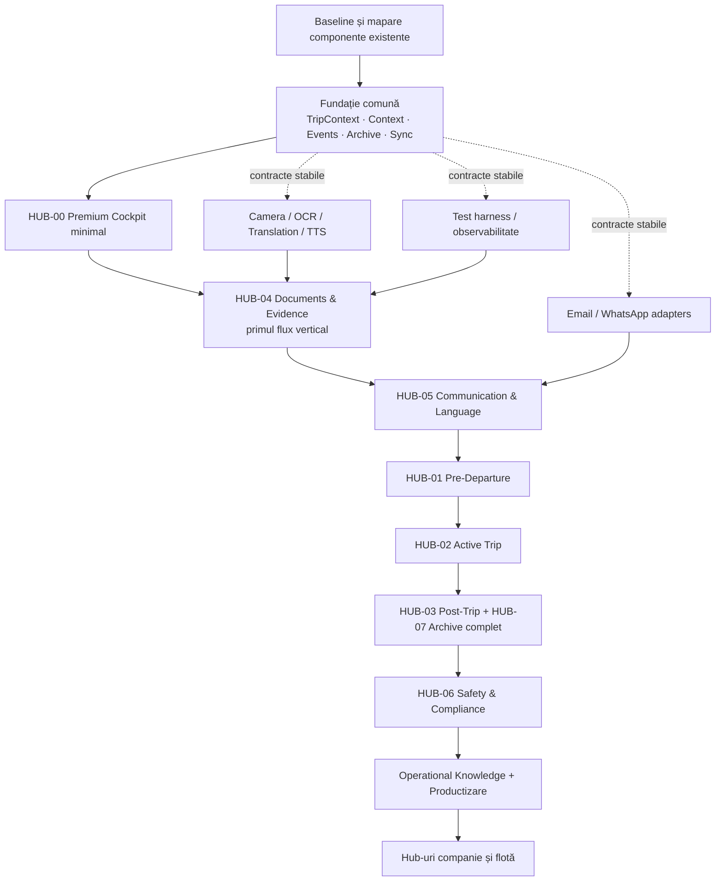

# AGM Premium — Strategia de implementare a Hub-urilor

Data: 2026-07-28  
Tip: analiză strategică și recomandare tehnică  
Regim: documentar; fără implementare, fără modificarea codului sau infrastructurii  
Autoritate de planificare: `ROADMAP.md`

## 1. Sinteză executivă

Strategia recomandată este **HIBRIDĂ, CU FUNDAȚIE SECVENȚIALĂ ȘI PARALELISM
CONTROLAT DUPĂ STABILIZAREA CONTRACTELOR**.

Nu se recomandă dezvoltarea simultană, complet independentă, a două Hub-uri.
Ambele ar modifica prematur `TripContext`, evenimentele, proiecțiile și regulile
de sincronizare, producând contracte concurente și refactorizări. Nu se recomandă
nici dezvoltarea strict secvențială a tuturor componentelor, deoarece serviciile
deja delimitate — Camera, OCR, traducere, voce și adaptoarele de comunicare — pot
fi pregătite în paralel după fixarea contractelor lor.

Ordinea recomandată:

1. fundația comună minimă și executabilă;
2. `HUB-00 Premium Cockpit` ca shell și proiecție a stării;
3. `HUB-04 Documents & Evidence` ca primul flux vertical complet;
4. `HUB-05 Communication & Language`, extins din același flux;
5. `HUB-01 Pre-Departure`;
6. `HUB-02 Active Trip`;
7. `HUB-03 Post-Trip`;
8. completarea `HUB-07 Operational Archive`;
9. `HUB-06 Safety & Compliance`;
10. Operational Knowledge, productizare și Hub-uri organizaționale.

Prin „primele două Hub-uri” de implementat trebuie înțelese **HUB-00 și HUB-04**,
nu primele două ID-uri numerice. `HUB-01 Pre-Departure` intră după ce fluxul
document–comunicare–arhivă a demonstrat fundația comună.

## 2. Baza deciziei

Strategia respectă următoarele reguli canonice:

- `TripContext` este modelul unic al cursei;
- Hub-urile nu dețin copii ale datelor canonice;
- comenzile produc rezultate și evenimente versionate;
- Arhiva Operațională este sursa canonică de evenimente și dovezi;
- serviciile comune nu modifică singure lifecycle-ul;
- offline/outbox/conflict/recovery sunt parte din fundație;
- un singur increment arhitectural poate modifica la un moment dat același
  agregat sau aceeași tranziție;
- fiecare increment are poartă de acceptare și checkpoint înainte de următorul.

## 3. Comparația variantelor

| Variantă | Avantaje | Dezavantaje și riscuri | Verdict |
| --- | --- | --- | --- |
| Paralelă | Viteză aparentă; echipele pot lucra simultan; feedback rapid pe mai multe UI-uri | Modele `TripContext` concurente; evenimente incompatibile; dublarea serviciilor; integrare târzie; conflicte pe shell, stocare și lifecycle; risc mare de refactorizare | Nerecomandată pentru fundație și primele Hub-uri |
| Secvențială | Control maxim; contracte stabile; integrare și audit simple; risc redus de conflict | Timp total mai mare; servicii independente stau blocate; feedback-ul utilizatorului sosește târziu; risc de proiectare excesivă a fundației | Recomandată numai pentru nucleul comun și tranzițiile canonice |
| Hibridă | Păstrează o singură fundație; permite paralelism pe servicii delimitate; livrează valoare verticală devreme; reduce integrarea tardivă | Necesită disciplină de contract, ownership clar, feature flags și integrare frecventă; paralelismul trebuie controlat | **Recomandată** |

### Regula practică a strategiei hibride

Se lucrează secvențial când schimbarea afectează:

- schema sau invariabilele `TripContext`;
- lifecycle-ul și matricea tranzițiilor;
- schema evenimentelor;
- autorizarea;
- EventStore/outbox/recovery;
- proiecțiile comune.

Se poate lucra în paralel când:

- contractul de intrare/ieșire este aprobat și versionat;
- componenta nu modifică direct lifecycle-ul;
- scrierile sunt izolate;
- integrarea folosește evenimente și referințe canonice;
- testele contractuale pot rula independent.

## 4. Fundația care precede Hub-urile

Fundația nu trebuie să devină un proiect abstract și nelimitat. Se implementează
minimumul necesar primului flux vertical.

### 4.1 Nucleu obligatoriu înaintea logicii de Hub

1. **TripContext minimal**
   - identitate și versiune;
   - lifecycle minimal;
   - operational flags;
   - referințe către documente, comunicări și evenimente;
   - `expectedVersion` și reguli de concurență.

2. **Context Operațional Comun**
   - `ContextScope`;
   - proiecții autorizate;
   - open items, warnings și confirmations;
   - interdicția copiilor de stare în Hub-uri.

3. **Event contract**
   - envelope comun;
   - `eventId`, `operationId`, `correlationId`, `causationId`;
   - actor, timp, versiune și scope;
   - registru și versiune de schemă.

4. **Arhivă Operațională minimă**
   - EventStore local și server;
   - Evidence Registry;
   - hash și referință la original;
   - proiecție timeline;
   - append-only și replay;
   - retenție minimă declarată.

5. **Persistență și continuitate**
   - salvare locală tranzacțională;
   - outbox idempotent;
   - sync;
   - conflict;
   - recovery.

6. **Securitate și observabilitate**
   - identity/access scope;
   - audit fără secrete;
   - correlation IDs;
   - health operațional;
   - stări clare online/offline/sync pending.

7. **Shell și registry**
   - rute Premium;
   - feature flags;
   - registru Hub-uri și capabilități;
   - boundary Basic/Premium.

### 4.2 Servicii comune pregătite pentru primul flux

| Serviciu | Ce trebuie stabilizat înainte | Poate reutiliza funcții existente? |
| --- | --- | --- |
| Camera/import | `MediaRef`, hash, scope și permisiuni | Da, prin adaptor public |
| OCR | `OcrProposal`, proveniență și confidence | Da |
| Human Review | acceptare/corectare și actor | Necesită contract comun |
| Document Store | original imuabil, derivări și versiuni | Necesită fundație comună |
| Document Analysis | findings/tasks/warnings versionate | Poate evolua incremental |
| Translation | original, limbi, scop și rezultat versionat | Da |
| Document Reader/TTS | text verificat și locale | Da |
| CommunicationDraft | scop, destinatar, canal, surse, stări | Necesită obiect canonic |
| Email handoff | `handed-off` separat de `delivered` | Da, prin adaptor |
| EventStore/Archive | evenimente, evidence, timeline și replay | Obligatoriu înaintea verticalei |

Vocea/STT și WhatsApp nu sunt necesare pentru a închide primul flux vertical.
Ele pot fi pregătite în paralel după stabilizarea contractului
`CommunicationDraft`, dar nu trebuie introduse pe calea critică inițială.

## 5. Primul flux vertical recomandat

Fluxul canonic este:

```text
Camera/Import
    ↓
MediaRef + hash
    ↓
Evidence Registry
    ↓
OCR proposal
    ↓
Verificare umană
    ↓
Document original + derivat verificat
    ↓
Analiză / Traducere / Citire
    ↓
CommunicationDraft
    ↓
Email handoff controlat
    ↓
Evenimente canonice
    ↓
Timeline + Arhivă Operațională
```

### De ce acesta este primul flux

- traversează toate straturile arhitecturii;
- reutilizează capabilități AGM deja existente;
- validează devreme cea mai costisitoare fundație: context, eventing, evidence,
  offline și arhivă;
- produce valoare directă pentru utilizator;
- include confirmare umană și trasabilitate;
- poate fi demonstrat în Browser și Android;
- creează contracte reutilizabile de Pre-Departure, Active Trip, Post-Trip,
  Safety și Communication;
- expune defectele de integrare înainte ca mai multe Hub-uri să depindă de ele.

## 6. Momentul introducerii Arhivei Operaționale

Arhiva trebuie introdusă **în Etapa 1, înaintea primului Hub funcțional**, într-o
formă minimă, nu după finalizarea Hub-urilor.

Ordinea corectă este:

1. contract de eveniment și evidence;
2. EventStore local/server și outbox;
3. timeline/proiecție minimă;
4. primul flux vertical;
5. extinderea retenției, căutării, exportului, sealing-ului și Operational
   Knowledge în etapele ulterioare.

Dacă Arhiva ar fi introdusă târziu, fiecare Hub ar inventa propriul istoric,
identificatori și reguli de retenție. Migrarea ulterioară ar necesita
reconstrucția provenienței și ar putea pierde legătura dintre original,
procesare, confirmare și comunicare.

Arhiva nu trebuie însă construită complet de la început. Se aplică principiul
„contract complet, implementare incrementală”: identitatea și semantica sunt
fixate devreme; funcțiile avansate apar când există utilizare reală.

## 7. Independență și dependențe

### 7.1 Pot evolua independent după aprobarea contractelor

- adaptoarele Camera și import;
- motorul OCR și evaluarea calității;
- Translation, Text Correction, STT și TTS;
- UI components fără stare de business;
- adaptoarele Email și WhatsApp;
- parserele și clasificatoarele de documente;
- exporturile și formatoarele de raport;
- test harness, simulatoare și fixture-uri;
- observabilitatea tehnică locală.

Acestea sunt independente numai la nivel intern. Rezultatele lor intră în sistem
prin DTO-uri, comenzi și evenimente canonice.

### 7.2 Depind obligatoriu de fundația comună

- orice stare sau tranziție a unei curse;
- Premium Cockpit și timeline;
- Pre-Departure READY gate;
- transferul către Active Trip;
- incidente, warnings și confirmations;
- documentele și dovezile asociate unei curse;
- `CommunicationDraft` asociat unui document sau incident;
- Post-Trip, archive sealing și raportul final;
- reconcilierea offline/server;
- accesul, retenția și auditul;
- Safety & Compliance cu efect asupra stării;
- Operational Knowledge derivat din evenimente.

### 7.3 Nu trebuie dezvoltate independent

- modele alternative de cursă în fiecare Hub;
- jurnale declarate surse canonice locale;
- stări de livrare inventate separat de Email și WhatsApp;
- lifecycle paralel pentru documente fără legătură cu `TripContext`;
- baze de date sau arhive proprii per Hub;
- sincronizare particulară per modul.

## 8. Ordinea recomandată de implementare

### Faza A — Reconcilierea baseline-ului

Se inventariază componentele deja implementate și se mapează la contractele
canonice. Nu se rescriu automat funcțiile existente.

Valoare: reduce duplicarea și stabilește ce poate fi adaptat.

### Faza B — Fundația comună minimă

Se închid EventStore server, accesul, proiecția UI comună, schema evenimentelor,
sync/outbox/conflict/recovery și `TripContext` minimal.

Valoare: sistemul poate păstra și reconstrui o operație reală.

### Faza C — HUB-00 Premium Cockpit minimal

Se livrează shell-ul, cursa activă, starea, flags, open items, navigarea și
timeline-ul minimal. Cockpit-ul nu conține logica Hub-urilor.

Valoare: punct unic și observabil pentru toate incrementările următoare.

### Faza D — HUB-04 Documents & Evidence vertical slice

Se implementează fluxul Camera–OCR–review–document–analysis/translation–
communication–events–archive.

Valoare: primul rezultat end-to-end pentru utilizator și prima probă reală a
arhitecturii.

### Faza E — HUB-05 Communication & Language

Se generalizează Translation, Correction, STT/TTS și `CommunicationDraft`; se
adaugă Email, apoi WhatsApp handoff, cu dovezi distincte de livrare.

Valoare: comunicare operațională reutilizabilă în toate etapele cursei.

### Faza F — HUB-01 Pre-Departure

Se construiesc checklist-ul, documentele obligatorii, vehicul/remorcă,
încărcătura, regulile și READY gate peste fundația deja demonstrată.

Valoare: prima fază completă a lifecycle-ului.

### Faza G — HUB-02 Active Trip

Se adaugă evenimentele de traseu, incidentele, instrumentele șofer, comunicarea
contextuală și offline extins.

Valoare: suport operațional în timpul cursei.

### Faza H — HUB-03 Post-Trip și completarea HUB-07

Se implementează sosirea, open-item disposition, raportul, manifestul,
integritatea, sealing-ul, retenția și exportul.

Valoare: lifecycle complet și dosar reconstructibil.

### Faza I — HUB-06 Safety & Compliance

Se consolidează regulile de siguranță și conformitate peste documente, incidente
și lifecycle deja stabile.

Valoare: controale transversale fără duplicarea datelor.

### Faza J — Knowledge, productizare și extindere

Se adaugă Operational Knowledge, entitlement, feature flags comerciale, cost
controls, onboarding și ulterior Hub-urile de flotă, dispecerat, parteneri și
analiză.

Valoare: produs Premium scalabil și extensibil.

## 9. Diagrama etapelor



Liniile punctate reprezintă paralelism permis. Lanțul principal reprezintă
ordinea de integrare și închidere, nu interdicția absolută de a pregăti
componente independente.

## 10. Criterii de trecere între etape

### Gate comun pentru fiecare increment

- scop, owner și fișiere autorizate;
- contracte de intrare/ieșire versionate;
- impact Basic/Premium/API/Android/date analizat;
- criterii de acceptare măsurabile;
- teste unitare, contract, integrare, offline și regresie relevante;
- dovezi Browser și Android pentru UI;
- securitate, minimizare și audit PASS;
- diff auditat și checkpoint închis;
- zero defecte critice și zero contradicții cu documentele canonice.

### Gate înainte de HUB-00

- modelul `TripContext` și lifecycle-ul minimal aprobate;
- schema evenimentelor stabilă;
- EventStore local/server funcțional;
- outbox, idempotency, replay și recovery demonstrate;
- proiecția comună poate reconstrui starea;
- boundary Basic/Premium verificat.

### Gate înainte de închiderea fluxului vertical

- originalul este imuabil și verificabil prin hash;
- OCR este marcat propunere până la review;
- rezultatele derivate păstrează proveniența;
- comunicarea necesită confirmare umană;
- `handed-off` nu este raportat drept `delivered`;
- fiecare pas produce eveniment și apare în timeline;
- fluxul funcționează online, offline și după recovery;
- Browser și Android PASS.

### Gate înainte de următorul Hub de lifecycle

- Hub-ul anterior nu deține copii de stare;
- handoff-ul folosește referințe și evenimente canonice;
- open items, warnings și incidents sunt transferabile;
- conflictele declanșează `RECOVERY_REQUIRED`;
- replay-ul reproduce aceeași proiecție;
- regresia fluxurilor deja închise este PASS.

### Gate înainte de productizare

- lifecycle complet demonstrat;
- retenție, export, manifest și sealing PASS;
- politici reale de acces și entitlement PASS;
- observabilitate și cost controls active;
- suport, recovery și rollback documentate;
- staging și aprobarea de lansare separate.

## 11. Riscuri și controale

| Risc | Strategie afectată | Control |
| --- | --- | --- |
| Contracte concurente pentru `TripContext` | Paralelă | Un singur owner al modelului și un singur increment arhitectural activ |
| Dublarea serviciilor comune | Paralelă | Registry de capabilități și consum exclusiv prin porturi publice |
| Integrare târzie | Paralelă | Integrare continuă prin flux vertical și teste contractuale |
| Blocarea livrării de o fundație prea mare | Secvențială | Fundație minimă pentru un singur flux real |
| Feedback utilizator întârziat | Secvențială | HUB-00 minimal și verticala Documents livrate devreme |
| Arhivă supradimensionată prematur | Ambele | Contract complet, implementare incrementală |
| Divergență Browser/Android | Ambele | Aceleași contracte și gate obligatoriu pe ambele suprafețe |
| Reutilizarea incorectă a Basic | Ambele | Adaptoare publice; fără importul stării interne Basic |
| Stare falsă de livrare Email/WhatsApp | Paralelă | State machine comună pentru `CommunicationDraft` |
| Conflicte offline și pierdere de date | Ambele | Outbox idempotent, optimistic versioning, replay și recovery |

## 12. Justificare arhitecturală

`HUB-00` este primul deoarece oferă proiecția unică a stării și face vizibile
sincronizarea, incidentele și pașii următori. Nu este suficient singur pentru a
demonstra valoare operațională.

`HUB-04` este al doilea deoarece solicită toate mecanismele dificile fără a
depinde de întregul lifecycle de transport. Documentele și dovezile sunt apoi
reutilizabile de Pre-Departure, Active Trip, Post-Trip și Safety.

`HUB-05` urmează natural deoarece folosește documentul verificat și produce
`CommunicationDraft`. Abia după stabilizarea acestor contracte este eficientă
construirea Pre-Departure, care le consumă în READY gate și handoff.

Arhiva începe înaintea Hub-urilor pentru ca identitatea, proveniența și
evenimentele să nu fie reconstruite retrospectiv. Funcțiile sale avansate sunt
amânate până când lifecycle-ul complet oferă cerințe reale.

Această ordine produce valoare la fiecare etapă și transformă fiecare increment
într-o probă pentru fundația următoare, fără a crea o platformă abstractă înainte
de existența fluxurilor utilizatorului.

## 13. Verdict final

# STRATEGIE RECOMANDATĂ: HIBRIDĂ CONTROLATĂ

Decizia tehnică recomandată:

1. fundația comună se închide secvențial;
2. primele Hub-uri livrate sunt `HUB-00` și `HUB-04`;
3. primul flux este
   `Camera → OCR → Verificare → Document → Analiză/Traducere → Comunicare →
   Evenimente → Arhivă`;
4. Arhiva Operațională minimă intră înaintea primului Hub funcțional;
5. paralelismul este permis numai pentru servicii cu contracte stabile și fără
   scrieri concurente în același agregat;
6. integrarea și închiderea etapelor rămân secvențiale, cu gate-uri explicite;
7. `HUB-01`, `HUB-02` și `HUB-03` extind ulterior lifecycle-ul deja demonstrat;
8. fiecare etapă trebuie să producă valoare utilizabilă, dovezi și reducerea unui
   risc arhitectural.

Verdict operațional al analizei:

**HYBRID IMPLEMENTATION STRATEGY — RECOMMENDED FOR CONTROLLED EXECUTION**

Acest verdict este o recomandare de strategie. Nu autorizează implementarea,
modificarea codului, infrastructurii sau Production. Fiecare increment necesită
mandat separat.

## 14. Referințe canonice

- `ROADMAP.md`
- `AGM_PREMIUM_ARCHITECTURAL_CONTRACT_V1.md`
- `AGM_PREMIUM_HUB_ARCHITECTURE_VISION_2026-07-28.md`
- `AGM_ORGANIZATIONAL_CONTRACT_V1.md`
- `AGM_PREMIUM_ROADMAP_VERIFICATION_REPORT_2026-07-28.md`

