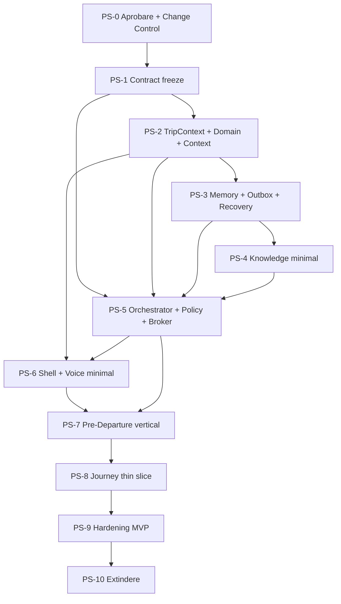

# Plan Structural AGM Premium v1

Versiune: 1.0  
Data elaborării: 2026-07-28  
Statut: **FINAL CANDIDATE — ÎN AȘTEPTAREA APROBĂRII ȘI CHANGE CONTROL**  
Autoritate de planificare: Turn Command Center  
Owner propus: Architecture Guardian  
Bază: consensul Workshop-ului multidisciplinar AGM Premium

## 1. Scop și autoritate

Acest document transformă viziunea AGM Premium într-un plan structural unitar
pentru:

- `HUB-01 Pre-Departure`;
- `Journey Operations Workspace`;
- infrastructura și serviciile comune care le deservesc;
- fluxurile, dependențele, etapele și criteriile de acceptare.

După aprobarea oficială și alinierea documentelor canonice prin Change Control,
acest plan devine referința structurală unică pentru implementarea celor două
workspace-uri.

Până la finalizarea acelor aprobări, documentul:

- nu modifică `ROADMAP.md`;
- nu înlocuiește Contractul Arhitectural;
- nu autorizează implementarea;
- nu autorizează modificări de cod, date, infrastructură sau Production.

## 2. Rezultatul urmărit

AGM Premium va oferi două medii operaționale complete, nu o colecție de
instrumente:

1. **HUB-01 Pre-Departure**
   - pregătește cursa;
   - identifică lipsuri și riscuri;
   - orchestrează documente, dovezi, cunoaștere și comunicare;
   - conduce controlat către `READY_CONFIRMED`, `READY_WITH_WARNINGS` sau
     `BLOCKED`.

2. **Journey Operations Workspace**
   - preia cursa printr-un handoff canonic;
   - asistă execuția, incidentele și comunicarea în `TRIP_ACTIVE`;
   - conduce sosirea și activitățile Post-Trip;
   - finalizează raportul, reconcilierea și pregătirea pentru arhivare.

Utilizatorul exprimă un obiectiv. Sistemul identifică serviciile necesare,
explică rezultatul, solicită confirmarea proporțională cu riscul și păstrează
proveniența completă.

## 3. Principii structurale obligatorii

1. Există un singur `TripContext` pentru fiecare cursă.
2. Hub-urile dețin workflow-uri și proiecții, nu copii ale datelor canonice.
3. Contextul Operațional Comun distribuie proiecții versionate și autorizate.
4. Operational Memory păstrează faptele și dovezile.
5. Validated Operational Knowledge păstrează numai cunoaștere verificată.
6. Căutarea este `Archive-first`; AI completează, explică sau analizează.
7. AI nu modifică direct lifecycle-ul și nu execută singur acțiuni critice.
8. Serviciile Comune sunt accesate prin contracte și Capability Broker.
9. Originalele sunt imuabile; OCR, traducerea și analiza sunt derivări.
10. Fiecare efect este versionat, idempotent, auditabil și recuperabil.
11. Offline, outbox, conflict și recovery sunt stări normale ale sistemului.
12. Vocea este interfața principală, completată de ecran.
13. Siguranța și controlul utilizatorului prevalează asupra reducerii pașilor.
14. Browser și Android folosesc același model de stare și aceleași contracte.
15. Implementarea începe ca modular monolith; distribuirea fizică este ulterioară
    și justificată operațional.

## 4. Imaginea structurală a sistemului

```text
┌─────────────────────────────────────────────────────────────────────┐
│ EXPERIENȚĂ                                                          │
│ Browser · Android · Voice Shell · Screen Confirmation               │
├─────────────────────────────────────────────────────────────────────┤
│ WORKSPACE-URI                                                       │
│ HUB-01 Pre-Departure │ Journey Operations                          │
│                      │ Active Trip + Post-Trip intern               │
├─────────────────────────────────────────────────────────────────────┤
│ WORKFLOW ȘI DECIZIE                                                 │
│ Intent Router · Operational Case/Task Graph · Hub Orchestrator      │
│ Policy/Safety/Permission Engine · Decision Envelope · Handoff       │
├─────────────────────────────────────────────────────────────────────┤
│ CONTEXT ȘI DOMENIU                                                  │
│ TripContext · Lifecycle · Common Operational Context · Commands     │
│ Open Items · Warnings · Incidents · Confirmations · Flags           │
├─────────────────────────────────────────────────────────────────────┤
│ CAPABILITY BROKER ȘI SERVICII COMUNE                                │
│ Camera · OCR · Review · Documents · Analysis · Translation          │
│ STT · TTS · AI · CommunicationDraft · Email · WhatsApp              │
│ Notifications · Search · Export · Driver Tools                      │
├─────────────────────────────────────────────────────────────────────┤
│ MEMORIE ȘI CUNOAȘTERE                                               │
│ EventStore · Evidence Registry · Document Store · Timeline          │
│ Operational Memory · Validated Operational Knowledge                │
├─────────────────────────────────────────────────────────────────────┤
│ CONTINUITATE ȘI ADAPTOARE                                           │
│ Local Store · Outbox · Sync · Conflict · Recovery · AGM API         │
│ Android Native · Browser · AI Providers · Email/WhatsApp Clients    │
├─────────────────────────────────────────────────────────────────────┤
│ CONTROL TRANSVERSAL                                                 │
│ Identity · Access · Audit · Retention · Observability · I18n        │
└─────────────────────────────────────────────────────────────────────┘
```

## 5. Contractele structurale comune

### 5.1 TripContext

Modelul unic al cursei păstrează:

```text
TripContext
├── tripId / tripVersion
├── lifecycleState
├── operationalFlags[]
├── actor / deviceId / permissions[]
├── driver / vehicle / trailer / cargo refs
├── locale / connectivity / syncState
├── openItems[] / warnings[] / incidents[]
├── confirmations[] / handoffRefs[]
├── lastKnownServerVersion
└── lastCanonicalEvent
```

Nicio operație cu efect nu poate deduce cursa numai din ecranul deschis.

### 5.2 ContextScope

```text
ContextScope =
  TripScope
  | DocumentScope
  | IncidentScope
  | CommunicationScope
  | StandaloneToolScope
```

Un rezultat standalone nu este asociat retroactiv unei curse fără o comandă
explicită și auditată.

### 5.3 IntentEnvelope

Normalizează intenția venită prin voce, ecran sau eveniment:

```text
IntentEnvelope
├── intentId / sessionId
├── actor / channel / locale
├── tripId / contextScope
├── requestedGoal
├── sourcePayloadRef
├── confidence
├── createdAt / expiresAt
└── correlationId
```

### 5.4 Operational Case și Task Graph

Fiecare obiectiv semnificativ devine un caz operațional:

```text
OperationalCase
├── caseId / tripId / type
├── goal / owner / priority
├── state
├── taskGraph[]
├── evidenceRefs[]
├── blockers[] / warnings[]
├── proposedActions[]
├── confirmations[]
├── handoffRefs[]
└── result / closureReason
```

Task Graph permite ramificare, reluare, excepții și handoff fără a impune o
succesiune rigidă de ecrane.

### 5.5 CaptureIntent

```text
CaptureIntent
├── captureId / tripId / caseId
├── purpose
├── expectedContentType
├── requestedByHub
├── permissions / retentionClass
├── locationTimePolicy
└── processingPipeline
```

Camera nu pornește fără scop și politică declarate.

### 5.6 Decision Envelope

Orice recomandare sau decizie propusă include:

```text
DecisionEnvelope
├── decisionId / caseId
├── proposal
├── sources[]
├── ruleVersions[]
├── modelProvenance
├── confidence / uncertainty
├── riskClass
├── permittedActions[]
├── confirmationLevel
├── validity / expiresAt
└── explanation
```

### 5.7 CommunicationDraft

```text
CommunicationDraft
├── draftId / tripId / caseId
├── purpose / recipient / channel
├── originalText / translatedText
├── contextRefs[] / evidenceRefs[]
├── attachments[]
├── state
├── actor / timestamps
└── providerProvenance / receiptRefs[]
```

Stări minime:

```text
DRAFT → REVIEWED → HANDED_OFF → SENT_CONFIRMED | FAILED
```

`HANDED_OFF` nu înseamnă `SENT_CONFIRMED`.

### 5.8 OperationalEvent

```text
OperationalEvent
├── eventId / eventType / schemaVersion
├── tripId / caseId / operationId
├── correlationId / causationId
├── actor / occurredAt
├── expectedVersion / resultingVersion
├── payloadRef
└── provenance / integrity
```

### 5.9 KnowledgeEntry

```text
KnowledgeEntry
├── knowledgeId / domain
├── title / content / structuredRules
├── source / authorityLevel
├── jurisdiction
├── effectiveFrom / effectiveTo
├── version / supersedes
├── owner / reviewer
├── lastVerifiedAt / reviewDueAt
├── status
└── citations[] / applicability[]
```

Stări:

```text
DRAFT → REVIEW → APPROVED → SUPERSEDED | WITHDRAWN
```

## 6. Mecanismul de orchestrare

### 6.1 Flux general

```text
Voce / Ecran / Eveniment
        ↓
Intent Router
        ↓
TripContext + Context Operațional Comun
        ↓
Policy / Safety / Permission Engine
        ↓
Operational Case / Task Graph
        ↓
Archive-first Retrieval
        ↓
Hub Orchestrator
        ↓
Capability Broker
        ↓
Servicii Comune
        ↓
Decision Envelope
        ↓
Confirmare proporțională cu riscul
        ↓
Domain Command
        ↓
EventStore + Outbox + Proiecții + Arhivă
        ↓
Noua stare + următoarea acțiune
```

### 6.2 Hub Orchestrator

Responsabilități:

- pornește sau reia un `OperationalCase`;
- evaluează task-urile eligibile;
- solicită capabilități;
- aplică timeout, retry și fallback;
- cere confirmări;
- comandă domeniul;
- nu conține regulile juridice sau de lifecycle;
- nu apelează direct furnizori externi.

### 6.3 Capability Broker

Responsabilități:

- rezolvă capabilitatea solicitată la adaptorul aprobat;
- aplică policy, entitlement și disponibilitate;
- declară online/offline/fallback;
- returnează rezultate versionate;
- păstrează independența Hub-ului față de provider;
- emite telemetrie și proveniență.

Exemple de solicitări:

- `captureEvidence`;
- `extractVerifiableText`;
- `analyzeDocument`;
- `translateForPurpose`;
- `readAccessibleText`;
- `prepareCommunication`;
- `retrieveValidatedKnowledge`.

### 6.4 Ordinea autorității

1. lifecycle și reguli deterministe;
2. permisiuni, siguranță și conformitate;
3. Operational Knowledge validat;
4. datele curente din `TripContext`;
5. analiză AI;
6. confirmare umană;
7. comandă de domeniu.

AI nu poate ocoli nivelurile precedente.

## 7. Structura HUB-01 Pre-Departure

### 7.1 Obiectiv

Transformă o cursă `DRAFT` într-o stare pregătită și justificată:

```text
DRAFT
→ PRE_DEPARTURE_IN_PROGRESS
→ READY_CONFIRMED | READY_WITH_WARNINGS | BLOCKED
```

### 7.2 Zone funcționale interne

1. **Situation Summary**
   - stare;
   - procent de pregătire;
   - blocaj principal;
   - următoarea acțiune;
   - sync și connectivity.

2. **Identity & Assignment**
   - șofer;
   - vehicul;
   - remorcă;
   - cursă;
   - destinație și interval.

3. **Documents & Evidence Projection**
   - documente obligatorii;
   - originale și status;
   - OCR/review;
   - dovezi lipsă;
   - proveniență.

4. **Cargo & Load Safety**
   - încărcătură;
   - Ladungssicherung;
   - ADR, dacă este aplicabil;
   - avertismente;
   - dovezi foto.

5. **Tachograph, Time & Rules**
   - date relevante;
   - verificări;
   - Knowledge aplicabil;
   - explicații și incertitudine.

6. **Communication**
   - comunicări necesare;
   - `CommunicationDraft`;
   - Email/WhatsApp handoff;
   - receipts și stări.

7. **READY Gate**
   - verificări trecute;
   - warnings acceptate;
   - blocaje;
   - confirmarea utilizatorului;
   - handoff către Journey Operations.

### 7.3 Proiecția UI

La intrare:

- o propoziție de stare;
- un risc/blocaj principal;
- o acțiune principală;
- dialog vocal disponibil;
- detalii progresive.

Hub-ul nu afișează implicit o grilă cu module.

### 7.4 Flux principal

```text
Deschidere / „Pot să plec?”
→ resume TripContext
→ evaluare checklist și open items
→ selectarea următorului task
→ servicii activate contextual
→ rezultat + explicație
→ confirmare, dacă este necesară
→ eveniment și actualizare proiecție
→ reevaluare READY/BLOCKED
→ handoff canonic
```

### 7.5 Flux document

```text
Document lipsă
→ CaptureIntent
→ Camera/import
→ MediaRef + hash
→ Evidence Registry
→ clasificare
→ OCR proposal
→ review pe excepții
→ document canonic
→ analiză/traducere/citire
→ task sau warning
→ evenimente + Operational Memory
```

### 7.6 Flux Ladungssicherung

```text
Necesitate de verificare
→ fotografie ghidată
→ clasificare vizuală propusă
→ Knowledge aplicabil
→ analiză + limite declarate
→ risc / recomandare
→ confirmare și dovezi
→ PASS / WARNING / BLOCKED
```

O concluzie AI nu certifică singură siguranța.

### 7.7 Flux comunicare

```text
Lipsă / risc / întrebare
→ context și surse
→ CommunicationDraft
→ corectare / traducere
→ review destinatar și conținut
→ confirmare
→ Email/WhatsApp handoff
→ receipt, dacă este disponibil
→ update case + timeline
```

### 7.8 Handoff către Journey Operations

Conține exclusiv referințe canonice:

- `tripId` și versiune;
- starea READY;
- warnings acceptate;
- restricții;
- open items;
- incidente;
- task-uri;
- documente și dovezi relevante;
- confirmări;
- `handoffId`.

Journey Operations confirmă primirea printr-un eveniment separat.

## 8. Structura Journey Operations Workspace

### 8.1 Obiectiv

Oferă o singură experiență după plecare, păstrând două faze interne:

```text
READY_* → TRIP_ACTIVE
→ ARRIVAL_RECORDED
→ POST_TRIP_IN_PROGRESS
→ COMPLETED
→ ARCHIVED
```

### 8.2 Zone funcționale comune

1. **Situation Summary**
   - fază;
   - stare;
   - următoarea acțiune;
   - incidente;
   - open items;
   - sync/offline.

2. **Active Work**
   - task-uri;
   - incidente;
   - schimbări;
   - comunicare;
   - dovezi.

3. **Driver Interaction**
   - voice;
   - acțiuni driving-safe;
   - notificări;
   - amânări.

4. **Documents & Communication Projection**
   - documente primite;
   - captură;
   - mesaje;
   - receipts.

5. **Arrival & Post-Trip**
   - sosire;
   - documente finale;
   - open-item disposition;
   - raport;
   - reconciliere;
   - pregătire arhivare.

### 8.3 Active Trip intern

Funcții:

- start controlat;
- evenimente de traseu;
- opriri și timp;
- incidente;
- schimbări de instrucțiuni;
- comunicare contextuală;
- Camera și dovezi;
- instrumente pentru șofer;
- offline extins.

Reguli:

- nu închide automat incidente;
- nu solicită sarcini vizuale în mers;
- păstrează warning-urile din Pre-Departure;
- permite reluarea după offline;
- prioritizează siguranța.

### 8.4 Flux incident

```text
Voce / buton sigur / detecție
→ incident.opened
→ severitate și scope
→ instrucțiune imediată sigură
→ dovadă, când este sigur
→ Archive-first Knowledge
→ acțiune / comunicare / handoff
→ resolution proposal
→ confirmare autorizată
→ incident disposition
→ candidat Knowledge, după închidere
```

### 8.5 Flux schimbare operațională

```text
Instrucțiune nouă
→ captură/import/comunicare
→ verificare sursă și actor
→ analiză impact
→ Decision Envelope
→ confirmare
→ task graph actualizat
→ evenimente și notificări
```

### 8.6 Arrival și Post-Trip intern

```text
TRIP_ACTIVE
→ înregistrare sosire
→ ARRIVAL_RECORDED
→ verificări post-trip
→ documente finale
→ open-item disposition
→ incidente rezolvate sau transferate
→ raport minimal/final
→ sincronizare și integritate
→ COMPLETED
→ retenție și archive sealing
→ ARCHIVED
```

Nu se permite `ARCHIVED` cu:

- `SYNC_PENDING`;
- `RECOVERY_REQUIRED`;
- conflict;
- incident critic fără dispoziție;
- dovadă critică lipsă;
- manifest invalid.

## 9. Voice Interaction

### 9.1 Model

```text
VoiceTurn
├── sessionId / tripId / locale
├── transcript
├── detectedIntent / confidence
├── evidenceRefs[]
├── proposedActions[]
├── confirmationLevel
├── drivingState
└── expiry
```

### 9.2 Capabilități MVP

- push-to-talk;
- întrebări și răspunsuri;
- citirea stării și a pasului următor;
- pornirea unui workflow;
- dictare;
- explicații;
- confirmări noncritice;
- comenzi: oprește, repetă, anulează, mai târziu;
- fallback pe ecran.

### 9.3 Clase de acțiuni

| Clasă | Regim |
| --- | --- |
| READ | poate fi executată vocal |
| PREPARE | sistemul pregătește rezultatul |
| CONFIRM | necesită accept explicit |
| CRITICAL_CONFIRM | read-back și confirmare suplimentară/vizuală |
| PROHIBITED_WHILE_DRIVING | amânată până la oprirea sigură |

### 9.4 Driving-safe

- răspunsuri scurte;
- fără liste lungi;
- fără corectare vizuală;
- fără compunere complexă;
- acțiunile neurgente sunt amânate;
- funcțiile critice cer oprire sigură;
- microfonul are stare vizibilă;
- audio brut nu este păstrat implicit fără scop aprobat.

## 10. Operational Memory

### 10.1 Conținut

- EventStore append-only;
- documente originale;
- MediaRef și hash;
- OCR și corecții;
- traduceri și analize;
- confirmări;
- CommunicationDraft și receipts;
- incidente;
- handoff-uri;
- recovery și conflicte;
- timeline;
- rapoarte și manifest.

### 10.2 Reguli

- originalul nu este suprascris;
- derivările sunt versionate;
- fiecare rezultat păstrează proveniența;
- proiecțiile sunt reconstruibile;
- corecțiile produc evenimente noi;
- retenția diferă pe categorie;
- accesul la fișier poate fi separat de accesul la metadate.

## 11. Validated Operational Knowledge

### 11.1 Domenii inițiale

- documente și formulare;
- proceduri Pre-Departure;
- Ladungssicherung;
- tahograf;
- ADR;
- siguranță;
- comunicare operațională;
- terminologie RO/DE/EN.

### 11.2 Domenii ulterioare

- legislație extinsă;
- întreținere;
- incidente și bune practici;
- proceduri Journey/Post-Trip;
- cunoaștere pentru flotă și companie.

### 11.3 Retrieval

Ordine:

```text
TripContext și scope
→ Knowledge aprobat și aplicabil
→ filtrare domeniu/jurisdicție/valabilitate
→ surse externe autorizate, dacă există
→ AI pentru sinteză/explicație/lipsuri
→ răspuns cu surse și incertitudine
```

Lipsa informației este declarată; AI nu inventează regula absentă.

### 11.4 Promovare

```text
caz închis
→ candidat
→ minimizare și anonimizare
→ verificarea sursei
→ expert review
→ aprobare
→ publicare versionată
→ revizuire / supersede / retragere
```

AI nu publică singur cunoaștere.

## 12. Serviciile Comune

| Capabilitate | Intrare canonică | Rezultat canonic | Consumatori |
| --- | --- | --- | --- |
| Camera/import | CaptureIntent | MediaRef + hash | ambele workspace-uri |
| OCR | MediaRef + scop | OcrProposal | Documents, Communication |
| Human Review | propunere + confidence | rezultat verificat | toate fluxurile document |
| Document Store | original + metadata | DocumentRef/version | ambele workspace-uri |
| Document Analysis | document + scop + rules | findings/tasks/warnings | Pre, Journey, Safety |
| Translation | original + locale + scop | TranslationResult | toate |
| STT | audio/stream + locale | transcript propus | Voice/Communication |
| TTS | text verificat + locale | redare | Voice/Documents |
| AI Analysis | context minimizat + scop | DecisionEnvelope parțial | orchestrator |
| Communication | CommunicationDraft | handoff/receipt | Pre/Journey |
| Notifications | event + policy | alert/action | workspace relevant |
| Search/Retrieval | query + access scope | rezultate cu surse | toate |
| Export | scope + authorization | artefact + manifest | Post-Trip/Archive |

Niciun serviciu nu schimbă singur lifecycle-ul.

## 13. Confirmări și reguli de siguranță

### 13.1 Confirmare obligatorie

- trimiterea comunicării externe;
- schimbarea destinatarului;
- acceptarea unui warning;
- declararea READY;
- startul cursei;
- închiderea incidentului;
- modificarea unei date critice;
- finalizarea și arhivarea;
- orice operație financiară/juridică viitoare.

### 13.2 Confirmare pe excepție

- câmp OCR sub prag;
- clasificare nesigură;
- surse contradictorii;
- context expirat;
- conflict offline/server;
- recomandare AI cu incertitudine relevantă.

### 13.3 Fără confirmare suplimentară

Pot rula automat, dacă sunt locale, reversibile și autorizate:

- citirea stării;
- căutarea;
- precompletarea;
- calculul progresului;
- pregătirea draftului;
- generarea unei proiecții;
- reluarea unui task necritic.

## 14. Fluxuri secundare

### 14.1 Recovery

```text
reconectare/start
→ verificare schemă și jurnal
→ outbox și ultima versiune
→ replay
→ conflict detection
→ resume sau RECOVERY_REQUIRED
```

### 14.2 Communication failure

```text
HANDED_OFF
→ receipt absent/failed
→ stare FAILED sau PENDING verificabil
→ open item
→ retry/handoff alternativ autorizat
→ eveniment
```

### 14.3 Knowledge unavailable

```text
retrieval fără rezultat suficient
→ declararea lipsei
→ AI opțional cu limite
→ surse externe autorizate, dacă există
→ expert handoff / task
→ candidat Knowledge numai după validare
```

### 14.4 Standalone tool

Traducerea sau citirea standalone rămân posibile prin `StandaloneToolScope`.
Rezultatul nu modifică o cursă fără asociere explicită.

## 15. MVP structural

### 15.1 Include

#### Fundație

- contractele din secțiunea 5;
- `TripContext` și lifecycle;
- Context Operațional Comun;
- EventStore local/server;
- Evidence Registry și Document Store minimal;
- outbox, idempotency, sync, conflict și recovery;
- orchestrator, Policy Engine și Capability Broker;
- Operational Memory minimal;
- Knowledge minimal;
- observabilitate și audit;
- shell comun Browser/Android;
- voice shell minimal.

#### Pre-Departure

- identitate cursă/șofer/vehicul;
- document obligatoriu;
- Camera/import;
- OCR și review;
- analiză/traducere/citire;
- un warning/task;
- CommunicationDraft;
- Email handoff;
- READY/BLOCKED;
- handoff canonic.

#### Journey Operations thin slice

- start controlat;
- un open item sau incident;
- dovadă și comunicare;
- sosire;
- dispoziție Post-Trip;
- raport minimal;
- completare și pregătire arhivare.

### 15.2 Nu include

- wake word;
- conversație vocală complexă multi-turn;
- WhatsApp bidirecțional avansat;
- certificare automată de siguranță;
- analiză vizuală completă pe toate domeniile;
- recomandări predictive;
- Knowledge multijurisdicțional complet;
- multi-user avansat;
- flotă/companie;
- rapoarte comerciale avansate;
- microservicii separate fără justificare.

## 16. Etapele de execuție propuse

| Etapa | Livrabil | Dependență | Criteriu de ieșire |
| --- | --- | --- | --- |
| PS-0 | Aprobarea Planului și Change Control | workshop închis | documente canonice aliniate |
| PS-1 | Contract freeze | PS-0 | toate contractele structurale versionate |
| PS-2 | Domain și Context | PS-1 | lifecycle, commands și proiecții PASS |
| PS-3 | Memory și continuitate | PS-2 | EventStore/outbox/replay/conflict/recovery PASS |
| PS-4 | Knowledge minimal | PS-3 | retrieval cu surse/valabilitate PASS |
| PS-5 | Orchestrare și capabilități | PS-1–4 | Policy/Broker/Decision/servicii contract PASS |
| PS-6 | Shell și voice minimal | PS-2, PS-5 | Browser/Android, fallback și driving-safe PASS |
| PS-7 | Pre-Departure vertical | PS-1–6 | flux complet până la READY/BLOCKED PASS |
| PS-8 | Handoff și Journey thin slice | PS-7 | start–incident–arrival–post-trip PASS |
| PS-9 | Hardening MVP | PS-7–8 | securitate, offline, recovery, regresie PASS |
| PS-10 | Extindere controlată | MVP aprobat | fiecare capabilitate are mandat și gate |

## 17. Dependențe



Paralelismul este permis numai pentru adaptoare și capabilități cu contracte
înghețate. Un singur increment poate modifica același agregat sau aceeași
tranziție.

## 18. Criterii de acceptare

### 18.1 Gate comun

- scop, owner, fișiere și criterii aprobate;
- contracte și scheme versionate;
- un singur owner pentru fiecare rezultat;
- impact Basic/Premium/API/Android/date analizat;
- teste unitare, contract, integrare, offline și regresie;
- dovezi Browser și Android;
- securitate, minimizare, acces și retenție PASS;
- proveniență completă;
- observabilitate și correlation ID;
- zero defecte critice;
- diff auditat;
- checkpoint și verdict explicit.

### 18.2 Gate funcțional

- utilizatorul finalizează obiectivul fără navigare manuală între servicii;
- o singură acțiune principală este prezentată;
- datele confirmate nu sunt reintroduse;
- rezultatul și următorul pas sunt clare;
- excepțiile sunt explicate;
- fluxul poate fi reluat;
- efectul este vizibil în timeline.

### 18.3 Gate de date

- nicio copie canonică paralelă;
- originalul și derivările sunt distincte;
- optimistic concurrency funcționează;
- replay produce aceeași proiecție;
- duplicatele sunt respinse idempotent;
- conflictul critic activează `RECOVERY_REQUIRED`.

### 18.4 Gate AI/Knowledge

- Archive-first demonstrat;
- sursele și valabilitatea sunt vizibile;
- AI declară incertitudinea;
- AI indisponibil nu blochează esențialul;
- Knowledge nu este publicat automat;
- modelul și regula au proveniență.

### 18.5 Gate Voice

- push-to-talk și indicator microfon;
- intent și confidence observabile;
- read-back pentru efecte importante;
- fallback pe ecran;
- driving-safe PASS;
- comenzile STOP/anulează funcționează;
- audio respectă politica de retenție.

### 18.6 Gate operațional

- outbox persistent;
- retry controlat;
- receipts distincte;
- health bazat pe probe;
- trace complet reconstructibil;
- recovery și rollback demonstrate;
- mod degradat sigur.

## 19. Riscuri, limitări și controale

| Risc/limitare | Control |
| --- | --- |
| Hub-ul devine meniu | acceptare pe journey slice |
| Orchestrator devine „god object” | workflow-uri mici; reguli în domain core |
| Context divergent | versiune, ownership și proiecții |
| Arhive concurente | un singur Operational Memory |
| Memory amestecat cu Knowledge | plane și lifecycle separate |
| Knowledge învechit | owner, valabilitate, review și retragere |
| AI hallucination | Archive-first, surse, confidence și refuz |
| Automatizare necontrolată | Decision Envelope și confirmare |
| Voice unsafe | clase de acțiuni și driving-safe |
| Voice spoofing | sesiune autentificată și read-back |
| Offline/pierdere | outbox, replay, conflict și recovery |
| Dublă execuție | operationId și idempotency |
| Comunicare fals declarată | handoff separat de receipt |
| Date sensibile | minimizare, criptare, RBAC și redaction |
| Divergență Browser/Android | contract comun și gate pe ambele |
| MVP prea mare | două fluxuri verticale limitate |
| Microservicii premature | modular monolith |
| Dependență provider | Capability Broker și adaptoare |
| Reducerea excesivă a confirmărilor | clasificarea riscului |

## 20. Ownership structural propus

| Domeniu | Accountable propus | Validator |
| --- | --- | --- |
| Prioritate și rezultat produs | Product Owner | Independent Assurance |
| Coerență structurală | Architecture Guardian | Inspector consistency |
| TripContext și domain | Backend & Data Custodian | QA/Inspector |
| Browser/Android/Voice UX | Frontend & Website Owner | QA + utilizator |
| AI/Translation/Localization | AI & Localization Owner | Inspector/QA |
| Memory, date și retenție | Data Accountable | Security/Inspector |
| Knowledge lifecycle | Documentation Owner + domain owner desemnat | Legal/Inspector |
| Operare și recovery | Release & Operations | Inspector |
| Security și access | Security Governance Owner | Inspector |
| Monitoring | Chief Monitoring Inspector | Chief Inspector/Turn |

Catalogul serviciilor trebuie actualizat prin Change Control înainte de
Production pentru serviciile noi rezultate din plan.

## 21. Impactul Change Control

După aprobarea Planului trebuie analizate și aliniate controlat:

1. `ROADMAP.md`
   - regruparea etapelor după journey slices;
   - voice minimal mutat din Backlog în MVP;
   - Pre-Departure ca prima acceptare de produs;
   - Journey Operations ca workspace compus.

2. `AGM_PREMIUM_HUB_ARCHITECTURE_VISION_2026-07-28.md`
   - clarificarea workspace-urilor percepute;
   - rolul transversal al HUB-00/HUB-04/HUB-05;
   - Capability Broker, Decision Envelope și Operational Case.

3. `AGM_PREMIUM_ARCHITECTURAL_CONTRACT_V1.md`
   - contractele noi;
   - Memory/Knowledge;
   - Voice/Driving-safe;
   - Archive-first;
   - orchestration policy.

4. `AGM_ORGANIZATIONAL_CONTRACT_V1.md`
   - catalogul serviciilor și ownerii, dacă activarea sa oficială impune amendare.

Istoricul etapelor și checkpoint-urile închise nu se rescriu.

## 22. Trasabilitate și livrabile

Fiecare etapă produce:

- mandat;
- design/ADR;
- contracte afectate;
- matrice de impact;
- implementare și diff, numai după autorizare;
- teste și dovezi;
- raport de securitate și operare;
- documentație;
- verdict;
- checksum și checkpoint.

## 23. Criteriul de finalizare al Planului Structural

Planul poate deveni activ numai dacă:

- Product confirmă experiența;
- Architecture confirmă boundary-urile;
- Backend/Data confirmă modelele;
- Security/Legal confirmă politicile;
- Operations confirmă recovery;
- Knowledge confirmă lifecycle-ul;
- QA/Inspector confirmă testabilitatea;
- Turn Command Center aprobă;
- Change Control aliniază documentele canonice.

## 24. Verdictul documentului

# PLAN STRUCTURAL COMPLET — RECOMANDAT PENTRU APROBARE ȘI CHANGE CONTROL

Varianta propusă oferă:

- două workspace-uri operaționale complete;
- o singură fundație;
- o singură memorie canonică;
- Knowledge validat;
- servicii comune invizibile utilizatorului;
- orchestrare controlată;
- voce sigură;
- MVP cu valoare end-to-end;
- extindere fără reorganizare majoră.

Acest verdict nu autorizează implementarea. Dezvoltarea poate începe numai după
aprobarea oficială, alinierea documentelor canonice și emiterea mandatului
dedicat pentru `PS-1` sau etapa decisă de Turn Command Center.

## 25. Referințe

- `AGM_PREMIUM_HUB_ARCHITECTURE_WORKSHOP_REPORT_2026-07-28.md`
- `AGM_PREMIUM_HUB_IMPLEMENTATION_STRATEGY_2026-07-28.md`
- `AGM_PREMIUM_HUB_ARCHITECTURE_VISION_2026-07-28.md`
- `AGM_PREMIUM_ARCHITECTURAL_CONTRACT_V1.md`
- `ROADMAP.md`
- `AGM_ORGANIZATIONAL_CONTRACT_V1.md`

