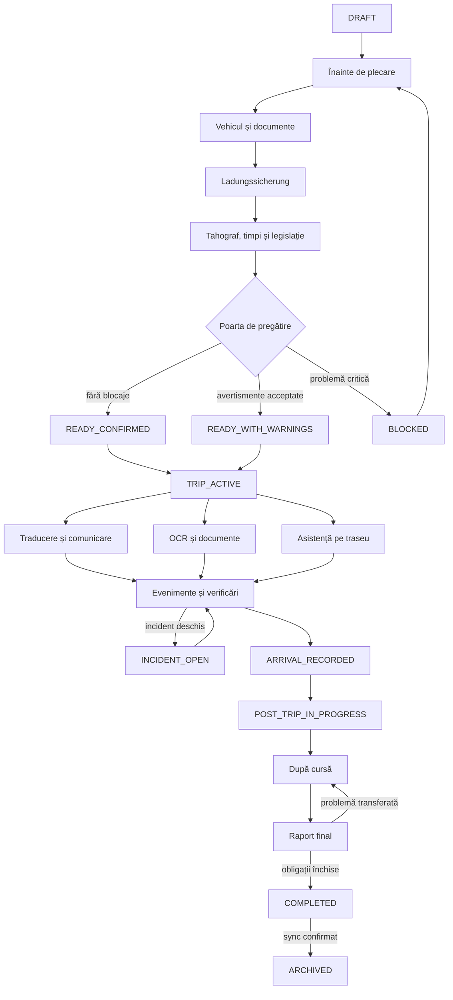

# Livrabil 1 — Diagrama completă a fluxului Premium

`OFFLINE`, `SYNC_PENDING` și `RECOVERY_REQUIRED` sunt stări operaționale
ortogonale și pot apărea peste orice etapă permisă. `RECOVERY_REQUIRED` blochează
tranzițiile ireversibile.

## Regula de continuitate

Fiecare poartă produce o listă de predare: date confirmate, avertismente,
incidente, sarcini deschise și dovezi. Schimbarea ecranului nu modifică starea și
nu închide elemente.
